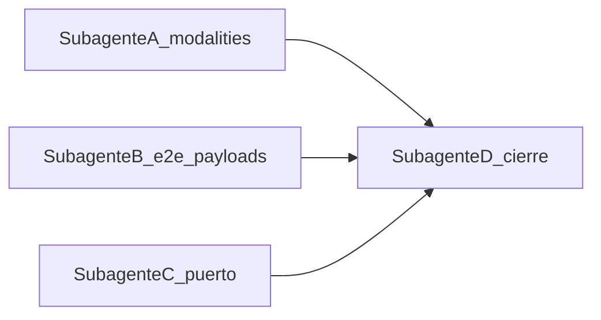

# Plan: corregir inconsistencias (typecheck + e2e)

## Diagnóstico

### 1. Fallo TS6305 (`backend-careers:typecheck`)

En [libs/backend/modalities/tsconfig.lib.json](libs/backend/modalities/tsconfig.lib.json) el `include` mezcla el código de otro proyecto:

```15:15:libs/backend/modalities/tsconfig.lib.json
  "include": ["src/**/*.ts", "../shared/src/**/*.ts"],
```

Con `rootDir: "../../../"`, TypeScript compila archivos de `shared` dentro del proyecto `modalities` y genera `.d.ts` en rutas como `modalities/dist/libs/backend/shared/...`, inconsistentes con el proyecto compuesto [libs/backend/shared/tsconfig.lib.json](libs/backend/shared/tsconfig.lib.json) (`rootDir: "src"`). Eso provoca **TS6305** cuando `careers` importa tipos desde `@backend/modalities` y la resolución cruza esas declaraciones.

**Corrección:** dejar solo `"include": ["src/**/*.ts"]` y mantener la referencia a shared:

```json
"references": [{ "path": "../shared/tsconfig.lib.json" }]
```

`modalities` ya declara dependencia en [libs/backend/modalities/package.json](libs/backend/modalities/package.json) y solo importa `@backend/shared` en código ([modalities.service.ts](libs/backend/modalities/src/modalities.service.ts)); no hace falta incluir fuentes de shared en el tsconfig.

Tras el cambio, conviene borrar `libs/backend/modalities/dist` una vez para no arrastrar artefactos viejos.

### 2. E2E de students desalineado con el backend

[apps/sistema-titulacion-servidor-e2e/src/sistema-titulacion-servidor/students.spec.ts](apps/sistema-titulacion-servidor-e2e/src/sistema-titulacion-servidor/students.spec.ts) construye payloads con `lastName` y `motherLastName`, pero el contrato está en [libs/backend/students/src/schemas/students.schemas.ts](libs/backend/students/src/schemas/students.schemas.ts): `paternalLastName`, `maternalLastName`, además de `birthDate`, `sex`, etc.

Los `expect` que usan `lastName` / `motherLastName` deben actualizarse a los nombres correctos.

### 3. Puerto del e2e vs servidor

[apps/sistema-titulacion-servidor-e2e/src/support/test-setup.ts](apps/sistema-titulacion-servidor-e2e/src/support/test-setup.ts) usa `PORT ?? '3000'`, mientras [apps/sistema-titulacion-servidor/.env.example](apps/sistema-titulacion-servidor/.env.example) y el default en [libs/backend/core/src/config/env.ts](libs/backend/core/src/config/env.ts) usan **4000**. Sin alinear, el e2e puede apuntar al puerto equivocado.

**Opción recomendada:** default `4000` en `test-setup.ts` o documentar `PORT=4000` en el target e2e / variables de entorno del proyecto.

---

## Trabajo por subagente

| Subagente           | Entregable                                                                                       | Archivos principales                                                                                                                                                                                                                                                           |
| ------------------- | ------------------------------------------------------------------------------------------------ | ------------------------------------------------------------------------------------------------------------------------------------------------------------------------------------------------------------------------------------------------------------------------------ |
| **A – TS graph**    | Quitar include de shared en modalities; limpiar `dist` si hace falta; verificar cadena typecheck | [libs/backend/modalities/tsconfig.lib.json](libs/backend/modalities/tsconfig.lib.json)                                                                                                                                                                                         |
| **B – E2E**         | Payloads y expectativas según schema; revisar PATCH/PUT                                          | [students.spec.ts](apps/sistema-titulacion-servidor-e2e/src/sistema-titulacion-servidor/students.spec.ts)                                                                                                                                                                      |
| **C – Entorno e2e** | Alinear `baseURL` con puerto del serve                                                           | [test-setup.ts](apps/sistema-titulacion-servidor-e2e/src/support/test-setup.ts), opcionalmente [global-setup.ts](apps/sistema-titulacion-servidor-e2e/src/support/global-setup.ts) / [global-teardown.ts](apps/sistema-titulacion-servidor-e2e/src/support/global-teardown.ts) |
| **D – Cierre**      | Lint + e2e Nx; revisar `package-lock.json` si hay ruido                                          | —                                                                                                                                                                                                                                                                              |

**Orden:** A puede ir en paralelo con B+C. D al final.



---

## Comandos de verificación

```bash
npx nx run backend-modalities:typecheck --skipNxCache
npx nx run backend-careers:typecheck --skipNxCache
npx nx run @sistema-titulacion/sistema-titulacion-servidor:typecheck --skipNxCache
npx nx run @sistema-titulacion/sistema-titulacion-servidor-e2e:e2e
```

**Criterio de hecho:** typecheck del servidor sin TS6305; e2e de students en verde con el serve estándar de Nx.
