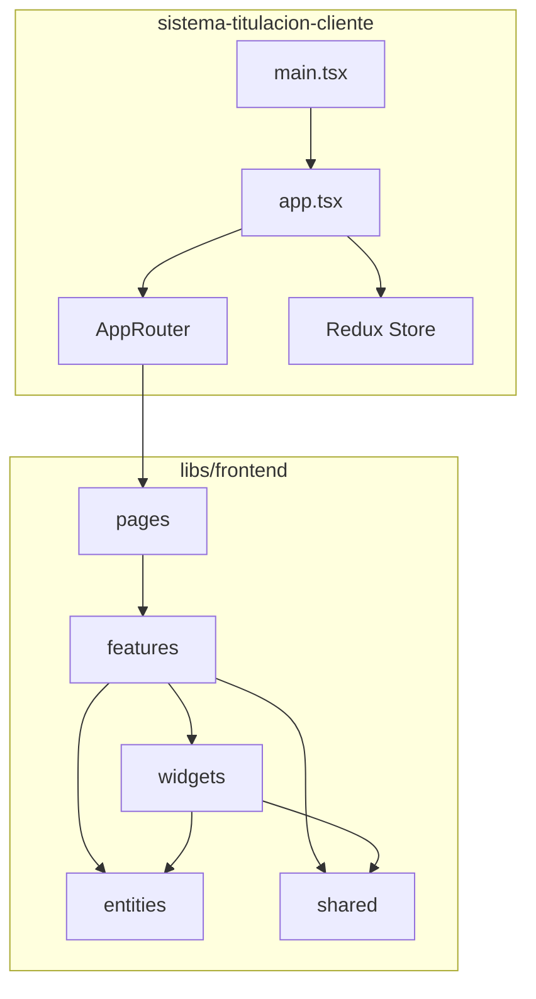
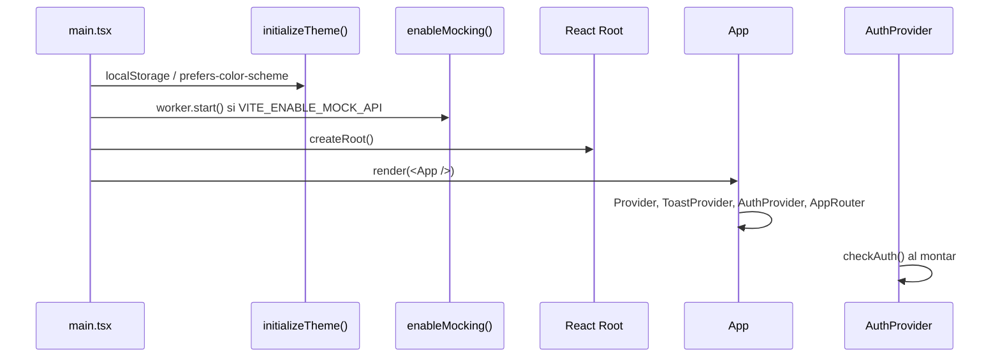
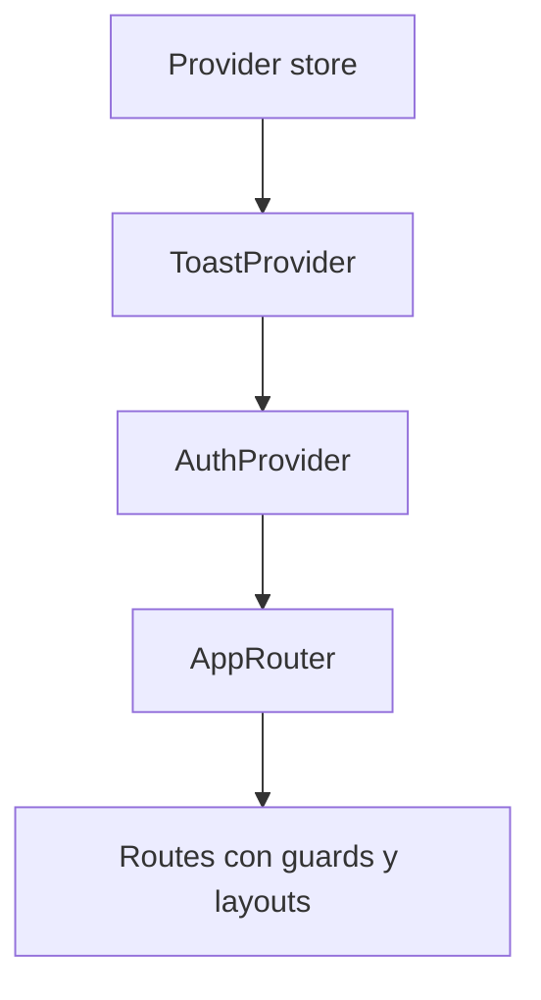

# sistema-titulacion-cliente

Aplicación cliente del **Sistema de Titulación**. Shell React que monta providers (Redux, Auth, Toast, Router) y consume las librerías del frontend (pages, features, widgets, entities, shared) bajo **Feature-Sliced Design** en el monorepo Nx.

---

## Tabla de contenidos

- [Descripción](#descripción)
- [Estructura del proyecto](#estructura-del-proyecto)
- [Diagramas](#diagramas)
- [Bootstrap y flujo de arranque](#bootstrap-y-flujo-de-arranque)
- [Providers](#providers)
- [Router y rutas](#router-y-rutas)
- [Store Redux](#store-redux)
- [MSW (Mock Service Worker)](#msw-mock-service-worker)
- [Configuración](#configuración)
- [Scripts y comandos](#scripts-y-comandos)
- [Documentación adicional](#documentación-adicional)

---

## Descripción

`sistema-titulacion-cliente` es la **aplicación web** que los usuarios finales ejecutan. Proporciona:

- **Bootstrap**: Inicialización del tema, MSW (opcional) y montaje de React
- **Providers**: Redux, Toast, Auth
- **Router**: Rutas protegidas, públicas y de administrador
- **Layout**: Sidebar + Header para páginas autenticadas
- **MSW**: API mock para desarrollo sin backend

La lógica de negocio reside en las **libs** (`@features`, `@pages`, etc.); la app actúa como orquestador.

---

## Estructura del proyecto

```
apps/sistema-titulacion-cliente/
├── public/
│   ├── favicon.ico
│   ├── mockServiceWorker.js     # Worker de MSW (generado por init-msw)
│   ├── images/
│   └── fonts/
│
├── src/
│   ├── main.tsx                 # Punto de entrada: tema, MSW, render
│   ├── styles.css               # Estilos globales (Tailwind, variables CSS)
│   │
│   ├── app/
│   │   ├── app.tsx              # App: Provider, ToastProvider, AuthProvider, AppRouter
│   │   └── providers/
│   │       ├── auth/            # AuthProvider (checkAuth al montar)
│   │       ├── redux/           # store, hooks (useAppDispatch, useAppSelector)
│   │       └── router/          # AppRouter, guards, layouts, lazyPages
│   │
│   └── mocks/                   # MSW para desarrollo
│       ├── browser.ts           # setupWorker
│       ├── handlers/            # Handlers por dominio
│       ├── data/                # Datos mock
│       └── utils/               # buildApiUrl, delay, token, etc.
│
├── .env.example                 # Variables de entorno de ejemplo
├── vite.config.ts               # Vite + aliases (@features, @entities, etc.)
├── index.html
└── package.json
```

---

## Diagramas

### Árbol de dependencias



### Flujo de bootstrap



### Jerarquía de providers



---

## Bootstrap y flujo de arranque

1. **main.tsx**

   - `initializeTheme()`: Lee `localStorage.theme` o `prefers-color-scheme`, aplica clase `dark` al `<html>`
   - `enableMocking()`: Si `VITE_ENABLE_MOCK_API` y desarrollo, inicia MSW
   - `createRoot().render(<App />)`

2. **App**

   - Monta `Provider` (Redux), `ToastProvider`, `AuthProvider`, `AppRouter`

3. **AuthProvider**

   - Llama a `checkAuth()` al montar
   - Muestra loader hasta que termine
   - Luego renderiza `children` (AppRouter)

4. **AppRouter**
   - Define rutas con guards y layouts
   - Las páginas se cargan con lazy loading

---

## Providers

### Redux (Provider)

- Store con todos los slices de features y entities
- Middleware que sincroniza `user` con auth (setUser/clearUser en login/logout/checkAuth)
- Ver `src/app/providers/redux/store.ts`

### ToastProvider

- Provee `useToast()` para notificaciones
- Componente de `@shared/ui`

### AuthProvider

- Ejecuta `checkAuth()` al montar
- Muestra "Verificando sesión..." hasta que finalice
- No provee contexto; usa `useAuth` de `@features/auth`

---

## Router y rutas

### Estructura

```
router/
├── AppRouter.tsx      # Definición de rutas
├── lazyPages.ts       # Lazy loading de páginas
├── guards/            # Protección de rutas
│   ├── ProtectedRoute # Requiere autenticación
│   ├── PublicRoute    # Solo si NO autenticado
│   └── AdminRoute     # Requiere rol ADMIN
├── layouts/
│   └── LayoutWithSidebar
└── components/
    └── PageLoader
```

### Rutas

| Ruta                               | Guard          | Layout            | Página                         |
| ---------------------------------- | -------------- | ----------------- | ------------------------------ |
| `/login`                           | PublicRoute    | —                 | LoginPage                      |
| `/`                                | —              | —                 | Redirect a /dashboard o /login |
| `/dashboard`                       | ProtectedRoute | LayoutWithSidebar | DashboardPage                  |
| `/graduation-options`              | ProtectedRoute | LayoutWithSidebar | GraduationOptionsPage          |
| `/generation`                      | ProtectedRoute | LayoutWithSidebar | GenerationsPage                |
| `/ingress-egresses`                | ProtectedRoute | LayoutWithSidebar | IngressEgressPage              |
| `/ingress-egresses/new-admissions` | ProtectedRoute | LayoutWithSidebar | NewAdmissionsPage              |
| `/students`                        | ProtectedRoute | LayoutWithSidebar | StudentsPage                   |
| `/students/in-progress`            | ProtectedRoute | LayoutWithSidebar | StudentsInProgressPage         |
| `/students/scheduled`              | ProtectedRoute | LayoutWithSidebar | StudentsScheduledPage          |
| `/students/graduated`              | ProtectedRoute | LayoutWithSidebar | StudentsGraduatedPage          |
| `/careers`                         | ProtectedRoute | LayoutWithSidebar | CareersPage                    |
| `/modalities`                      | ProtectedRoute | LayoutWithSidebar | ModalitiesPage                 |
| `/reports`                         | ProtectedRoute | LayoutWithSidebar | ReportsPage                    |
| `/accesses`                        | **AdminRoute** | LayoutWithSidebar | AccessesPage                   |
| `/backups`                         | ProtectedRoute | LayoutWithSidebar | BackupsPage                    |
| `*`                                | —              | —                 | Redirect a /                   |

Ver `src/app/providers/router/README.md` para detalles del router.

---

## Store Redux

### Slices registrados

| Slice             | Origen                       |
| ----------------- | ---------------------------- |
| user              | @entities/user               |
| login             | @features/auth               |
| auth              | @features/auth               |
| users             | @features/users              |
| generations       | @features/generations        |
| graduationOptions | @features/graduation-options |
| careers           | @features/careers            |
| modalities        | @features/modalities         |
| newAdmissions     | @features/new-admissions     |
| ingressEgress     | @features/ingress-egress     |
| students          | @features/students           |
| capturedFields    | @features/captured-fields    |
| graduations       | @features/graduations        |
| backups           | @features/backups            |
| reports           | @features/reports            |

### Middleware de sincronización

El store incluye un middleware que:

- En `loginThunk.fulfilled` → `setUser(payload)`
- En `logoutThunk.fulfilled/rejected` → `clearUser()`
- En `checkAuthThunk.fulfilled` → `setUser(payload)`
- En `checkAuthThunk.rejected` → `clearUser()`

### Hooks tipados

```typescript
import { useAppDispatch, useAppSelector } from './providers/redux';

const dispatch = useAppDispatch();
const user = useAppSelector((state) => state.user.currentUser);
```

---

## MSW (Mock Service Worker)

En desarrollo, si `VITE_ENABLE_MOCK_API=true`, se usa MSW para interceptar peticiones y responder con datos mock.

### Handlers

- `auth.handlers`
- `users.handlers`
- `graduation-options.handlers`
- `generations.handlers`
- `modalities.handlers`
- `careers.handlers`
- `new-admissions.handlers`
- `students.handlers`
- `captured-fields.handlers`
- `graduations.handlers`
- `ingress-egress.handlers`
- `dashboard.handlers`
- `backups.handlers`
- `reports.handlers`

### Inicializar MSW

```bash
npm run init-msw
```

Genera `public/mockServiceWorker.js`.

Ver `docs/COMO_USAR_MSW.md` para más detalles.

---

## Configuración

### Variables de entorno

Copiar `.env.example` a `.env` y ajustar:

| Variable             | Descripción                 | Ejemplo                      |
| -------------------- | --------------------------- | ---------------------------- |
| VITE_APP_ENV         | development / production    | development                  |
| VITE_API_BASE_URL    | URL base del API            | http://localhost:4000/api/v1 |
| VITE_API_TIMEOUT     | Timeout de peticiones (ms)  | 5000                         |
| VITE_ENABLE_LOGGER   | Habilitar logger            | true                         |
| VITE_MIN_LOG_LEVEL   | debug / info / warn / error | debug                        |
| VITE_ENABLE_MOCK_API | Usar MSW en desarrollo      | false                        |
| VITE_MOCK_API_DELAY  | Latencia de mocks (ms)      | 300                          |

### Aliases (Vite / tsconfig)

- `@features` → libs/frontend/features/src
- `@entities` → libs/frontend/entities/src
- `@pages` → libs/frontend/pages/src
- `@shared` → libs/frontend/shared/src
- `@widgets` → libs/frontend/widgets/src

---

## Scripts y comandos

| Comando                               | Descripción                          |
| ------------------------------------- | ------------------------------------ |
| `nx serve sistema-titulacion-cliente` | Servidor de desarrollo (puerto 4200) |
| `nx build sistema-titulacion-cliente` | Build de producción                  |
| `nx test sistema-titulacion-cliente`  | Ejecutar tests                       |
| `npm run init-msw`                    | Generar mockServiceWorker.js         |

---

## Documentación adicional

- **[shared](../../libs/frontend/shared/README.md)** — API, config, lib (logger, excel, validación, tipos, tema) y componentes UI
- **[entities](../../libs/frontend/entities/README.md)** — Modelos de dominio (User, Student, Career, etc.) y userSlice
- **[features](../../libs/frontend/features/README.md)** — Lógica de negocio por dominio (auth, students, careers, etc.)
- **[widgets](../../libs/frontend/widgets/README.md)** — Sidebar, Header, PageHeader
- **[pages](../../libs/frontend/pages/README.md)** — Páginas de orquestación por ruta
- **[mocks](src/mocks/README.md)** — MSW: handlers, datos mock y utilidades
