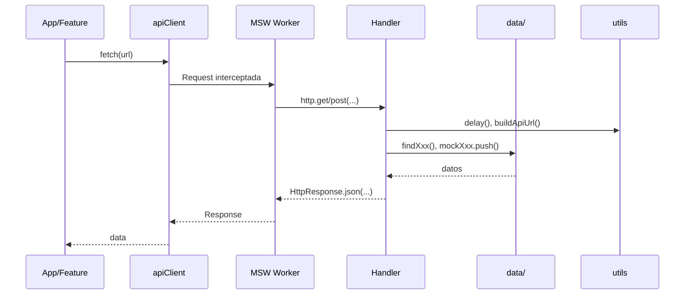
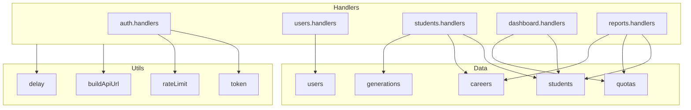

# Mocks — API Mock con MSW

Carpeta de **Mock Service Worker (MSW)** para desarrollo sin backend. Intercepta las peticiones HTTP dirigidas a la API y responde con datos simulados, permitiendo desarrollar y probar el frontend de forma independiente.

---

## Tabla de contenidos

- [Descripción](#descripción)
- [Estructura de carpetas](#estructura-de-carpetas)
- [Diagramas](#diagramas)
- [Componentes](#componentes)
- [Handlers](#handlers)
- [Datos (data)](#datos-data)
- [Utilidades (utils)](#utilidades-utils)
- [Activar MSW](#activar-msw)
- [Credenciales de prueba](#credenciales-de-prueba)
- [Agregar nuevos handlers](#agregar-nuevos-handlers)

---

## Descripción

MSW intercepta las peticiones a `VITE_API_BASE_URL` (por defecto `http://localhost:4000/api/v1`) y responde según los **handlers** definidos. Los handlers:

- Usan `API_ENDPOINTS` de `@shared/api`
- Consultan y mutan los datos mock en memoria
- Soportan paginación, filtros, ordenamiento y validaciones
- Simulan latencia con `delay()` (configurable con `VITE_MOCK_API_DELAY`)

**Activación**: MSW solo se ejecuta cuando `VITE_ENABLE_MOCK_API=true` y `VITE_APP_ENV=development`.

---

## Estructura de carpetas

```
src/mocks/
├── browser.ts           # setupWorker con todos los handlers
├── index.ts             # Reexporta handlers, worker, utils, data
│
├── handlers/            # Handlers MSW por dominio
│   ├── index.ts         # Combina todos los handlers
│   ├── auth.handlers.ts
│   ├── users.handlers.ts
│   ├── students.handlers.ts
│   ├── careers.handlers.ts
│   ├── generations.handlers.ts
│   ├── modalities.handlers.ts
│   ├── graduation-options.handlers.ts
│   ├── quotas.handlers.ts
│   ├── ingress-egress.handlers.ts
│   ├── captured-fields.handlers.ts
│   ├── graduations.handlers.ts
│   ├── dashboard.handlers.ts
│   ├── backups.handlers.ts
│   └── reports.handlers.ts
│
├── data/                # Datos mock y funciones de búsqueda
│   ├── index.ts
│   ├── users.ts
│   ├── students.ts
│   ├── careers.ts
│   ├── generations.ts
│   ├── modalities.ts
│   ├── graduation-options.ts
│   ├── quotas.ts
│   ├── captured-fields.ts
│   ├── graduations.ts
│   └── backups.ts
│
└── utils/               # Utilidades para handlers
    ├── index.ts
    ├── buildApiUrl.ts   # Construye URL completa
    ├── delay.ts         # Latencia configurable
    ├── token.ts         # Tokens mock y rotación
    └── rateLimit.ts     # Rate limiting (login, refresh)
```

---

## Diagramas

### Flujo de una petición con MSW activo



### Dependencias entre módulos



---

## Componentes

### browser.ts

Configura el worker de MSW para el navegador:

```typescript
import { setupWorker } from 'msw/browser';
import { handlers } from './handlers';

export const worker = setupWorker(...handlers);
```

Se usa en `main.tsx` cuando MSW está habilitado.

### handlers/index.ts

Centraliza todos los handlers. Para agregar uno nuevo:

1. Crear `xxx.handlers.ts`
2. Importar y añadir al array:

```typescript
import { xxxHandlers } from './xxx.handlers';

export const handlers: HttpHandler[] = [
  ...authHandlers,
  ...xxxHandlers,
  // ...
];
```

---

## Handlers

| Handler                | Endpoints principales                                             |
| ---------------------- | ----------------------------------------------------------------- |
| **auth**               | POST login, logout, refresh; GET me                               |
| **users**              | CRUD, activate/deactivate, changePassword, patchMe                |
| **students**           | CRUD, in-progress, scheduled, graduated, status, egress, unegress |
| **careers**            | CRUD, activate/deactivate                                         |
| **generations**        | CRUD, activate/deactivate                                         |
| **modalities**         | CRUD, activate/deactivate                                         |
| **graduation-options** | CRUD, activate/deactivate                                         |
| **quotas**             | CRUD, activate/deactivate                                         |
| **ingress-egress**     | list, getByGenerationAndCareer                                    |
| **captured-fields**    | getByStudent, create, update, patch, delete                       |
| **graduations**        | getByStudent, create, update, graduate, ungraduate                |
| **dashboard**          | GET dashboard (estadísticas agregadas)                            |
| **backups**            | list, getById, create, delete, restore, upload                    |
| **reports**            | POST generate (por-generaciones, por-carreras, summary)           |

### Patrón de un handler

- Usa `buildApiUrl(API_ENDPOINTS.XXX.ENDPOINT)` para la URL
- Llama a `await delay()` al inicio
- Para autenticación: `extractUserIdFromToken(request)` y `findUserById()`
- Consulta datos con `findXxx()` de `data/`
- Mutaciones: modificar arrays/objetos en `data/` (ej. `mockUsers.push()`)
- Respuestas: `HttpResponse.json({ ... }, { status: 200 })`

---

## Datos (data)

Cada archivo en `data/` expone:

- **Array mock**: `mockUsers`, `mockStudents`, etc. (se muta in-place)
- **findXxx**: búsquedas por id, email, etc.
- **generateXxxId**: IDs para nuevos registros

### Relaciones entre datos

Los datos están vinculados por IDs:

- **Career** → modalityId (Modality)
- **Student** → careerId, generationId
- **Quota** → generationId, careerId
- **CapturedFields** → studentId
- **Graduation** → studentId, graduationOptionId

Los handlers que calculan datos agregados (dashboard, reports, ingress-egress) cruzan estas relaciones.

### Contraseñas (users)

Las contraseñas se guardan en un `Map` interno (`userPasswords`). Usuarios por defecto:

- `admin@example.com` / `password123` (ADMIN)
- `staff@example.com` / `password123` (STAFF)

---

## Utilidades (utils)

### buildApiUrl

Construye la URL completa usando `env.apiBaseUrl`:

```typescript
buildApiUrl('/auth/login'); // → http://localhost:4000/api/v1/auth/login
```

### delay

Simula latencia de red. Por defecto usa `VITE_MOCK_API_DELAY` (ms):

```typescript
await delay(); // Usa VITE_MOCK_API_DELAY
await delay(500); // 500ms fijos
```

### token

Funciones para tokens mock:

- `generateToken(userId)`, `generateRefreshToken(userId)`
- `extractUserIdFromToken(token)`, `extractUserIdFromRefreshToken(refreshToken)`
- `storeRefreshToken`, `validateRefreshToken`, `invalidateRefreshToken` (rotación)
- `TOKEN_EXPIRES_IN` (3600 segundos)

### rateLimit

`checkRateLimit(request, 'LOGIN' | 'REFRESH')` devuelve `true` si se supera el límite:

- **LOGIN**: 5 intentos en 15 minutos
- **REFRESH**: 10 intentos en 15 minutos

En ese caso el handler responde con `429 Too Many Requests`.

---

## Activar MSW

1. Generar el service worker:

   ```bash
   npm run init-msw
   ```

2. Configurar `.env`:

   ```env
   VITE_ENABLE_MOCK_API=true
   VITE_MOCK_API_DELAY=300
   ```

3. Iniciar la app:
   ```bash
   nx serve sistema-titulacion-cliente
   ```

Ver `docs/COMO_USAR_MSW.md` para más detalles.

---

## Credenciales de prueba

| Usuario | Email             | Password    | Rol   |
| ------- | ----------------- | ----------- | ----- |
| Admin   | admin@example.com | password123 | ADMIN |
| Staff   | staff@example.com | password123 | STAFF |

---

## Agregar nuevos handlers

1. Crear `handlers/xxx.handlers.ts`:

```typescript
import { http, HttpResponse } from 'msw';
import { buildApiUrl, delay } from '../utils';
import { mockXxx } from '../data/xxx';

export const xxxHandlers = [
  http.get(buildApiUrl('/xxx'), async ({ request }) => {
    await delay();
    return HttpResponse.json({ data: mockXxx });
  }),
];
```

2. Registrar en `handlers/index.ts`:

```typescript
import { xxxHandlers } from './xxx.handlers';
export const handlers = [...existingHandlers, ...xxxHandlers];
```

3. Si hace falta, crear `data/xxx.ts` con los datos mock y las funciones de búsqueda/creación.

---

## Dependencias

- **msw** – Interceptación de peticiones
- **@shared/api** – API_ENDPOINTS
- **@shared/config** – env (apiBaseUrl)
- **@entities/** – Tipos (User, Student, Career, etc.)
