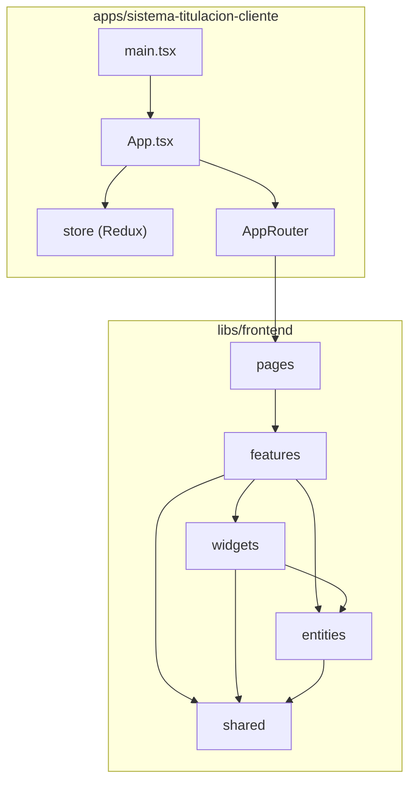
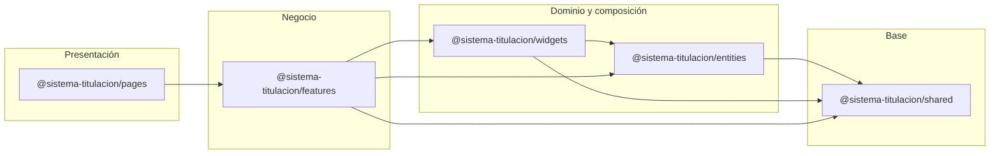
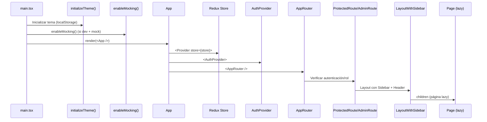
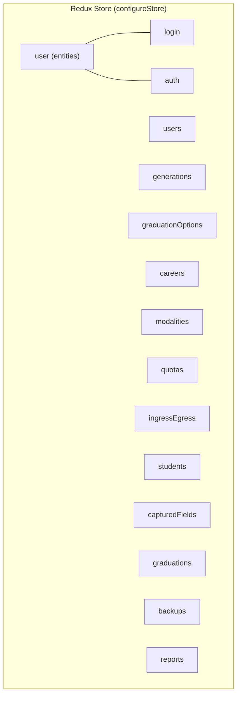
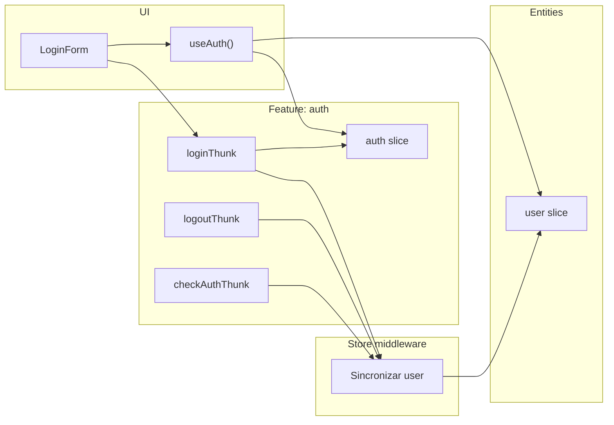
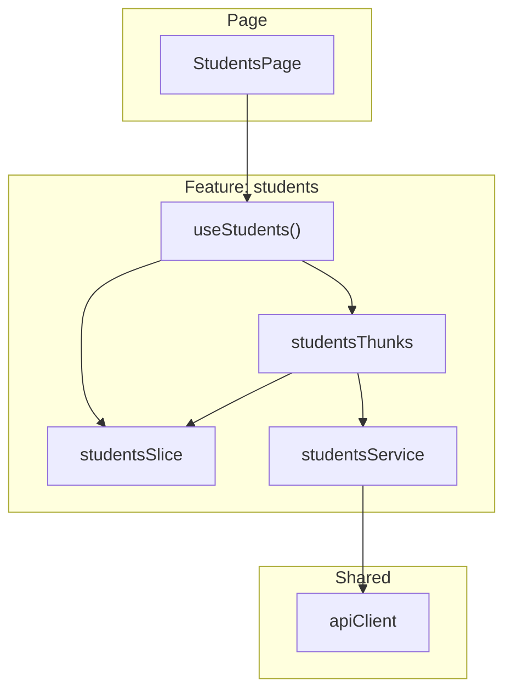
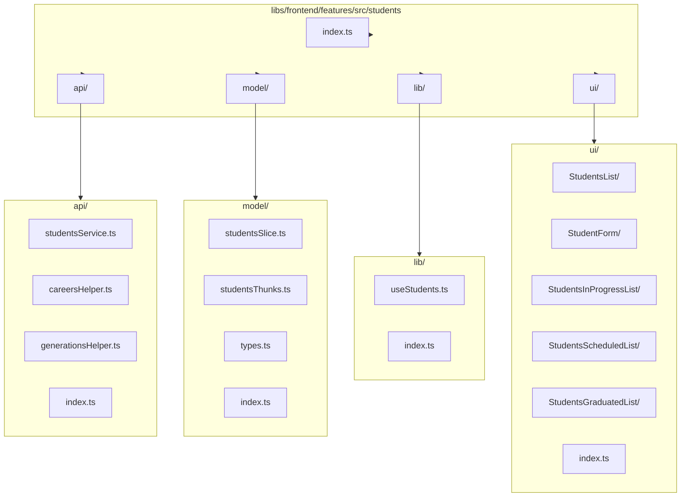

# Arquitectura del frontend — Sistema de titulación

Documento de referencia con diagramas Mermaid sobre la arquitectura del proyecto, flujo de datos entre slices Redux y estructura de carpetas.

---

## 1. Vista general de la arquitectura

La aplicación cliente (`sistema-titulacion-cliente`) es una shell que monta providers (Redux, Auth, Toast, Router) y consume librerías del frontend bajo un esquema tipo **Feature-Sliced Design** dentro del monorepo Nx.



---

## 2. Dependencias entre capas (libs/frontend)

Las librerías siguen un grafo de dependencias acíclico: las capas superiores dependen de las inferiores, nunca al revés.



**Regla:** `shared` no depende de nadie; `pages` solo de `features`; `features` de `entities`, `shared` y `widgets`; `widgets` de `shared` y `entities`.

---

## 3. Flujo de la aplicación (bootstrap y rutas)

Desde el punto de entrada hasta el render de una página.



---

## 4. Redux Store: estructura y slices

El store está compuesto por un reducer raíz que combina todos los slices. El único flujo cruzado explícito es **auth → user** vía middleware.



| Slice               | Origen           | Descripción                                          |
| ------------------- | ---------------- | ---------------------------------------------------- |
| `user`              | `@entities/user` | Usuario actual y flag `isAuthenticated`              |
| `login`             | `@features/auth` | Estado del formulario de login                       |
| `auth`              | `@features/auth` | Loading, error y estado de verificación de sesión    |
| `users` … `reports` | `@features/*`    | Dominios de negocio (listas, paginación, CRUD, etc.) |

---

## 5. Flujo de datos entre slices (Auth ↔ User)

El único acoplamiento entre slices es **auth → user**: cuando los thunks de auth terminan, el middleware actualiza el slice `user` para mantener sincronizado al usuario logueado.



**Acciones del middleware:**

- `loginThunk.fulfilled` → `setUser(payload)`
- `logoutThunk.fulfilled` o `rejected` → `clearUser()`
- `checkAuthThunk.fulfilled` → `setUser(payload)`
- `checkAuthThunk.rejected` → `clearUser()`

El resto de slices (users, careers, students, etc.) **no leen** el estado de otros slices en thunks; cada uno maneja su propio dominio. La “comunicación” entre dominios se hace en la UI (varios `useSelector` o hooks que leen distintos slices).

---

## 6. Flujo de datos en un feature (ej. Students)

Patrón típico: **UI → hook → thunks/slice → API**. Los slices no dependen entre sí a nivel de estado.



---

## 7. Estructura de carpetas del monorepo

```
sistema-titulacion/
├── apps/
│   └── sistema-titulacion-cliente/     # Aplicación React (shell)
├── libs/
│   └── frontend/
│       ├── entities/                   # Modelos de dominio
│       ├── features/                   # Lógica de negocio por dominio
│       ├── pages/                      # Páginas (composición)
│       ├── shared/                     # API, config, UI, utilidades
│       └── widgets/                    # Header, Sidebar, PageHeader
├── docs/
├── nx.json
└── package.json
```

---

## 8. Estructura de carpetas de libs/frontend

```
libs/frontend/
├── entities/                 # Modelos de dominio (tipos, userSlice)
│   └── src/
│       ├── user/, career/, generation/, student/, modality/, ...
│       └── index.ts
├── features/                 # Lógica de negocio por dominio
│   └── src/
│       ├── auth/, careers/, students/, users/, graduations/, ...
│       └── index.ts
├── pages/                    # Páginas (composición de features)
│   └── src/
│       ├── LoginPage/, DashboardPage/, CareersPage/, StudentsPage/, ...
│       └── index.ts
├── shared/                   # API, config, UI, utilidades
│   └── src/
│       ├── api/, config/, lib/, ui/
│       └── index.ts
└── widgets/                  # Header, Sidebar, PageHeader
    └── src/
        ├── Header/, Sidebar/, PageHeader/
        └── index.ts
```

---

## 9. Estructura de carpetas de la app cliente

```
apps/sistema-titulacion-cliente/
├── public/                 # Assets estáticos, fuentes, mockServiceWorker.js
├── scripts/                # init-msw.js
├── src/
│   ├── main.tsx            # Entrada: tema, MSW, ReactDOM.render(App)
│   ├── styles.css
│   ├── app/
│   │   ├── app.tsx         # Providers: Redux, Toast, Auth, Router
│   │   └── providers/
│   │       ├── auth/       # AuthProvider
│   │       ├── redux/      # store, hooks
│   │       └── router/     # AppRouter, guards, layouts, lazyPages
│   └── mocks/              # MSW: handlers y datos mock por dominio
├── docs/                   # Cómo usar filtros, MSW, Table
├── index.html
├── vite.config.ts         # Aliases @features, @entities, @pages, @shared, @widgets
├── tsconfig.*.json
└── package.json
```

---

## 10. Estructura interna de un módulo: feature `students`

Cada feature sigue la misma estructura: **api**, **model** (slice + thunks + types), **lib** (hooks), **ui** (componentes). Sirve como referencia para otros features (careers, users, graduations, etc.).



**Árbol de archivos del feature `students`:**

```
libs/frontend/features/src/students/
├── index.ts                    # Re-export público del feature
├── api/
│   ├── index.ts
│   ├── studentsService.ts      # Llamadas HTTP (apiClient)
│   ├── careersHelper.ts        # Helpers para datos de carreras
│   └── generationsHelper.ts    # Helpers para datos de generaciones
├── model/
│   ├── index.ts
│   ├── studentsSlice.ts        # Estado (listas, paginación, loading, errores)
│   ├── studentsThunks.ts       # createAsyncThunk (fetch, create, update, delete)
│   └── types.ts                # Tipos del dominio
├── lib/
│   ├── index.ts
│   └── useStudents.ts          # Hook: useSelector + dispatch de thunks
└── ui/
    ├── index.ts
    ├── StudentsList/           # Lista principal
    │   ├── index.ts
    │   └── StudentsList.tsx
    ├── StudentForm/            # Formulario crear/editar
    │   ├── index.ts
    │   └── StudentForm.tsx
    ├── StudentsInProgressList/
    ├── StudentsScheduledList/
    └── StudentsGraduatedList/
```

En este módulo se ve claramente la separación: **api** (servicios), **model** (Redux), **lib** (hooks que unen UI y store), **ui** (componentes).

---

## 11. Resumen de diagramas

| Sección | Contenido                                                                       |
| ------- | ------------------------------------------------------------------------------- |
| §1      | Arquitectura general: app shell + libs                                          |
| §2      | Grafo de dependencias entre libs (shared → entities/widgets → features → pages) |
| §3      | Secuencia bootstrap: main → App → Store → Auth → Router → Guard → Layout → Page |
| §4      | Redux Store: slices y su rol                                                    |
| §5      | Flujo de datos entre slices: solo auth → user vía middleware                    |
| §6      | Flujo típico en un feature: Page → useX → thunks/slice → API                    |
| §7      | Estructura de carpetas del monorepo                                             |
| §8      | Estructura de carpetas de libs/frontend                                         |
| §9      | Estructura de carpetas de la app cliente                                        |
| §10     | Estructura interna del módulo `students` (árbol + diagrama)                     |

Para mantener los diagramas al día, conviene actualizar este documento cuando se añadan nuevos slices, features o rutas.
