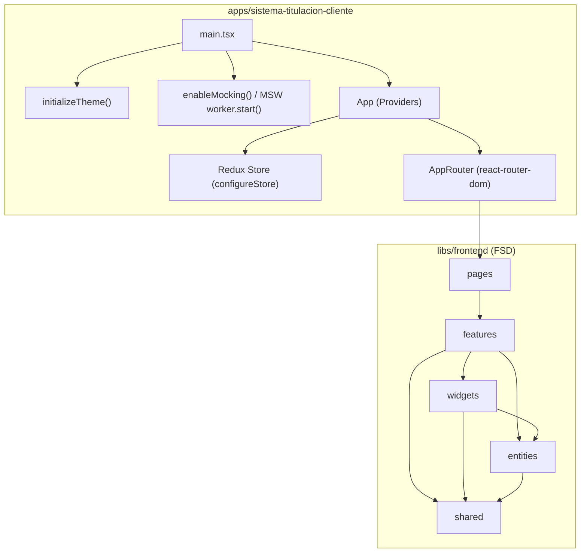
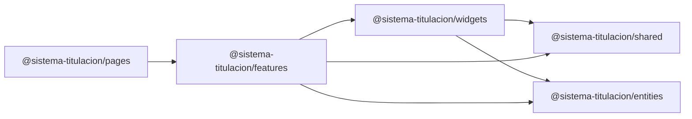
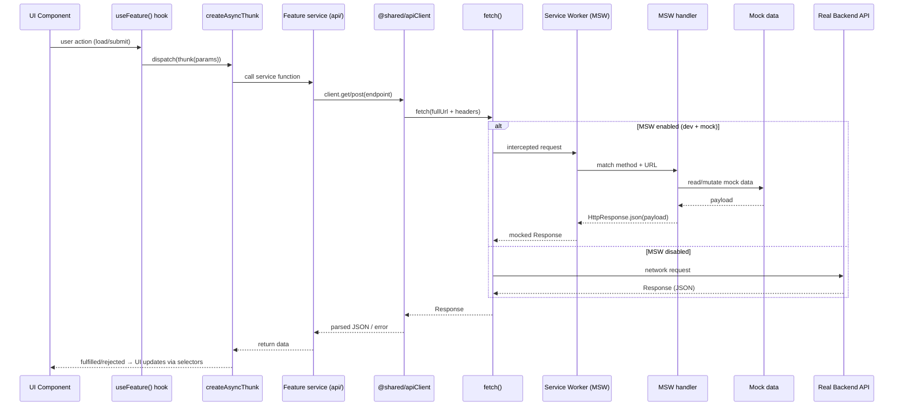
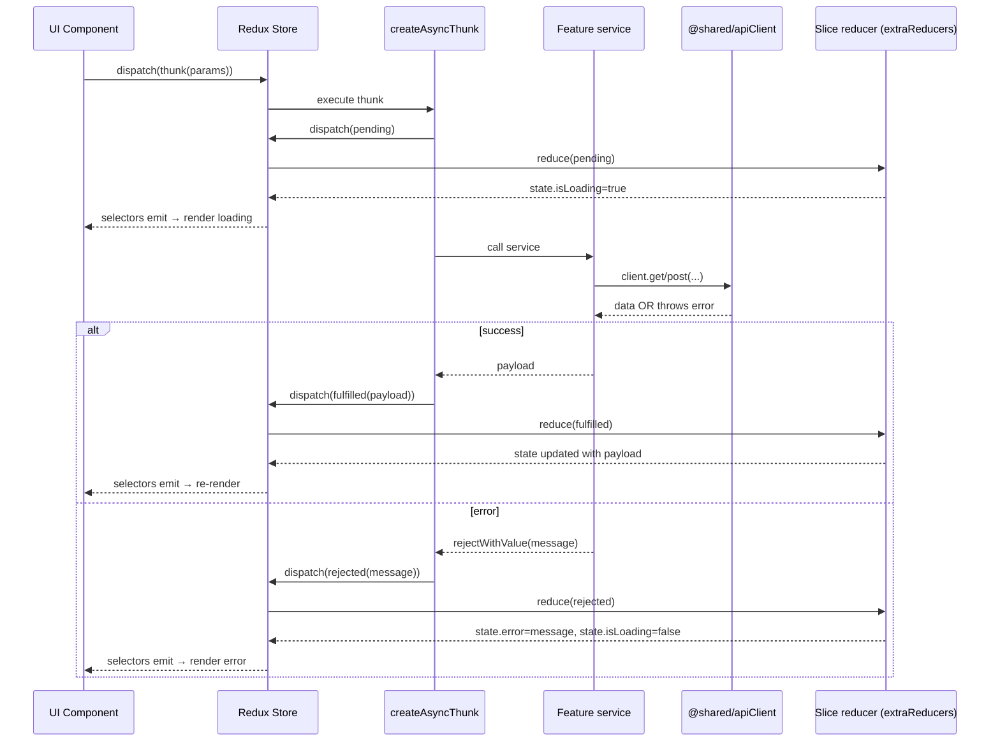
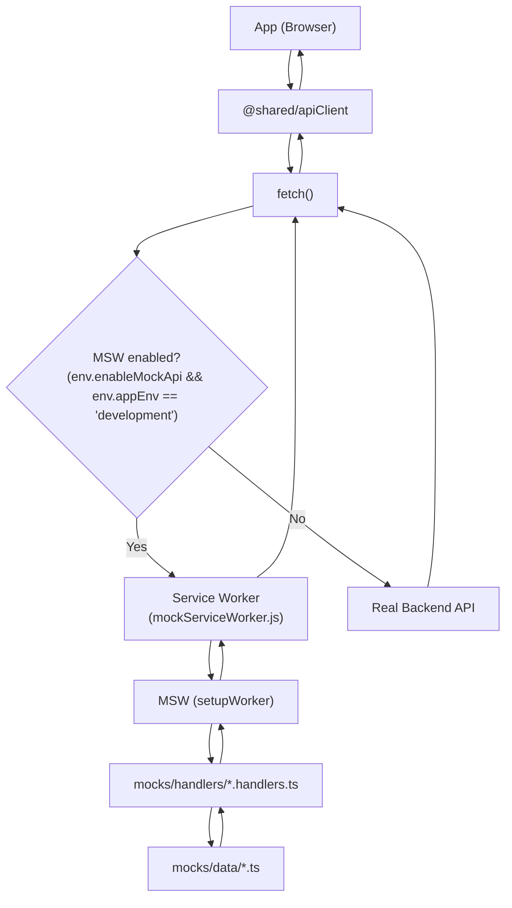
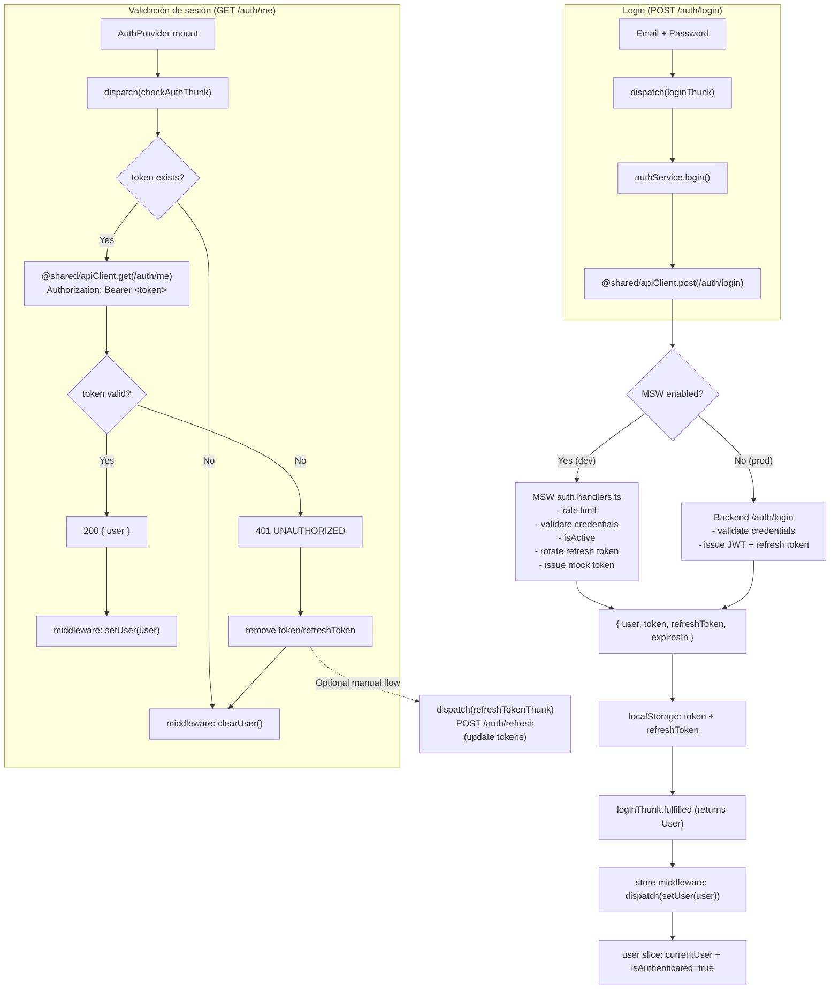

# Diagramas Mermaid — Arquitectura Frontend (Nx + FSD)

Este documento consolida los diagramas Mermaid y árboles de carpetas solicitados para el frontend del monorepo **Nx**.

**Fuentes principales (repo):**

- `docs/ARQUITECTURA_FRONTEND.md`
- `docs/API_DOCUMENTATION.md`
- `apps/sistema-titulacion-cliente/src/main.tsx` (bootstrap + MSW)
- `apps/sistema-titulacion-cliente/src/app/providers/redux/store.ts` (Redux store + middleware)
- `libs/frontend/shared/src/api/apiClient.ts` (API client + Authorization header)
- `apps/sistema-titulacion-cliente/src/mocks/handlers/auth.handlers.ts` (login/refresh/me/logout en MSW)
- `libs/frontend/features/src/auth/*` (hook + thunks + slices + service)

---

## 1) Arquitectura general: `sistema-titulacion-cliente` + librerías en Nx



---

## 2) Estructuras de carpetas de las capas (simplificadas)

### shared

```text
libs/frontend/shared/src/
├── index.ts
├── api/
├── config/
├── lib/
└── ui/
```

### entities

```text
libs/frontend/entities/src/
├── index.ts
├── user/
├── career/
├── student/
├── generation/
├── modality/
├── graduation-option/
├── new-admission/
├── graduation/
├── ingress-egress/
├── captured-fields/
└── ...
```

### widgets

```text
libs/frontend/widgets/src/
├── index.ts
├── Header/
├── PageHeader/
└── Sidebar/
```

### features

```text
libs/frontend/features/src/
├── index.ts
├── auth/
├── students/
├── careers/
├── users/
├── generations/
├── modalities/
├── graduation-options/
├── new-admissions/
├── graduations/
├── captured-fields/
├── ingress-egress/
├── dashboard/
├── backups/
├── reports/
└── ...
```

### pages

```text
libs/frontend/pages/src/
├── index.ts
├── LoginPage/
├── DashboardPage/
├── StudentsPage/
├── CareersPage/
├── UsersPage/
├── GenerationsPage/
├── ModalitiesPage/
├── GraduationOptionsPage/
├── NewAdmissionsPage/
├── ReportsPage/
├── BackupsPage/
├── ComingSoonPage/
└── ...
```

### Estructura detallada (ejemplo: feature `students`)

Único módulo con subdirectorios expandidos para referencia.

```text
libs/frontend/features/src/students/
├── index.ts
├── api/
│   ├── index.ts
│   ├── studentsService.ts
│   ├── careersHelper.ts
│   └── generationsHelper.ts
├── model/
│   ├── index.ts
│   ├── studentsSlice.ts
│   ├── studentsThunks.ts
│   └── types.ts
├── lib/
│   ├── index.ts
│   └── useStudents.ts
└── ui/
    ├── index.ts
    ├── StudentsList/
    ├── StudentForm/
    ├── StudentsInProgressList/
    ├── StudentsScheduledList/
    └── StudentsGraduatedList/
```

---

## 3) Grafo de dependencias acíclico (Nx) entre `shared`, `entities`, `widgets`, `features` y `pages`



---

## 4) Diagrama de secuencia del flujo de datos: UI → Hook → Thunk → API Client → MSW Interceptor



---

## 5) Diagrama del árbol de estado global (Redux Store) mostrando la jerarquía de slices

```mermaid
flowchart TB
  Root["RootState (Redux Store)"]

  Root --> user["user"]
  Root --> login["login"]
  Root --> auth["auth"]
  Root --> users["users"]
  Root --> generations["generations"]
  Root --> graduationOptions["graduationOptions"]
  Root --> careers["careers"]
  Root --> modalities["modalities"]
  Root --> newAdmissions["newAdmissions"]
  Root --> ingressEgress["ingressEgress"]
  Root --> students["students"]
  Root --> capturedFields["capturedFields"]
  Root --> graduations["graduations"]
  Root --> backups["backups"]
  Root --> reports["reports"]

  user --> user_currentUser["currentUser"]
  user --> user_isAuthenticated["isAuthenticated"]

  auth --> auth_isLoading["isLoading"]
  auth --> auth_isCheckingAuth["isCheckingAuth"]
  auth --> auth_error["error"]

  login --> login_email["email"]
  login --> login_password["password"]
  login --> login_isLoading["isLoading"]
  login --> login_submitError["submitError"]
  login --> login_fieldErrors["fieldErrors"]
```



---

## 6) Diagrama de secuencia: UI → Disparador (Dispatch) → Thunk → API → Reducer → Actualización de UI



---

## 7) Diagrama de flujo de intercepción de red: App → Service Worker → MSW Handlers → Mock Data



---

## 8) Diagrama de flujo del proceso de Login y validación de JWT

> Nota: en **dev** con MSW, el “JWT” es un token mock (`mock-token-*`). En **prod**, el backend emitiría JWT real; el cliente solo asume `Bearer <token>` y consume `/auth/me`.


