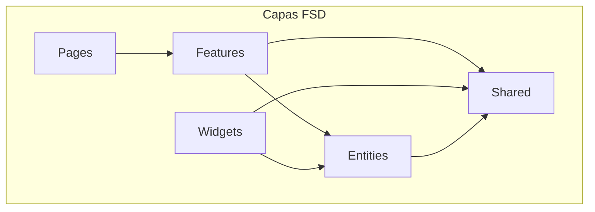
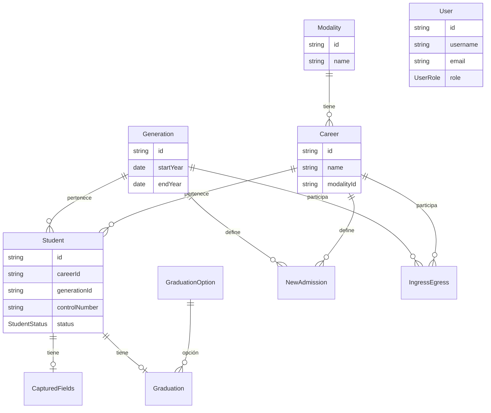
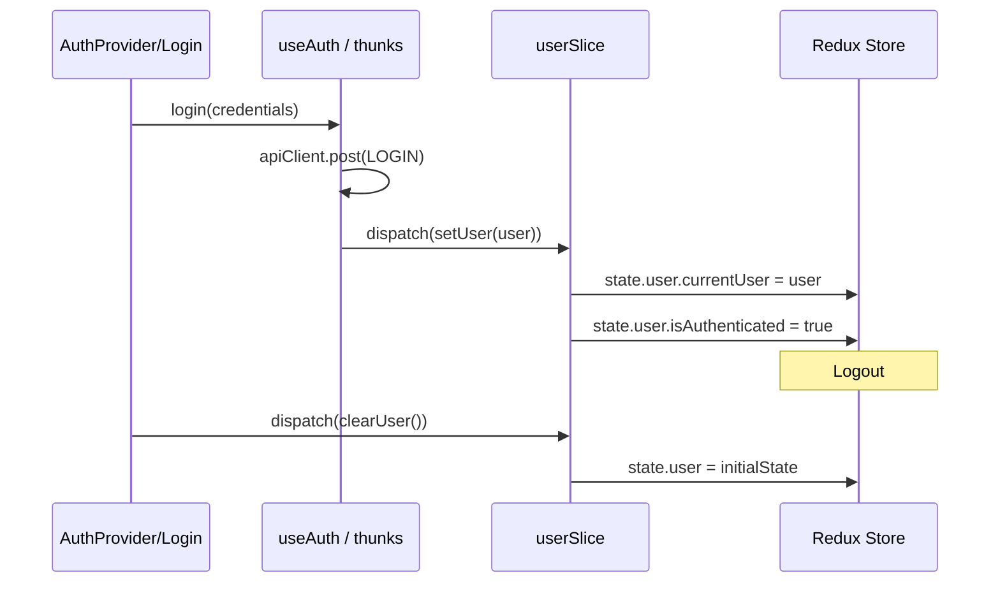

# @sistema-titulacion/entities

Módulo **entities** del frontend del Sistema de Titulación. Contiene los modelos de dominio y tipos de negocio que representan las entidades del sistema, consumidos por las capas superiores (features, widgets) siguiendo la arquitectura **Feature-Sliced Design (FSD)**.

---

## Tabla de contenidos

- [Descripción](#descripción)
- [Estructura de carpetas](#estructura-de-carpetas)
- [Diagramas](#diagramas)
- [Entidades](#entidades)
- [Relaciones entre entidades](#relaciones-entre-entidades)
- [User y Redux](#user-y-redux)
- [Uso e importaciones](#uso-e-importaciones)
- [Dependencias](#dependencias)

---

## Descripción

El módulo `entities` define las entidades de dominio del Sistema de Titulación:

- **Tipos e interfaces** que representan los modelos de datos del backend
- **Enums** para estados y roles
- **userSlice** (Redux) para el usuario actual y autenticación

Las entidades **no contienen lógica de negocio** ni llamadas a API; solo definen la estructura de los datos.

---

## Estructura de carpetas

```
libs/frontend/entities/
├── src/
│   ├── user/                    # Usuario y autenticación
│   │   ├── model/
│   │   │   ├── types.ts         # User, UserRole
│   │   │   ├── userSlice.ts     # Redux slice (currentUser, isAuthenticated)
│   │   │   └── index.ts
│   │   └── index.ts
│   │
│   ├── student/                 # Estudiante
│   │   ├── model/
│   │   │   ├── types.ts         # Student, Sex, StudentStatus
│   │   │   └── index.ts
│   │   └── index.ts
│   │
│   ├── career/                  # Carrera
│   │   ├── model/
│   │   │   ├── types.ts         # Career (incluye Modality)
│   │   │   └── index.ts
│   │   └── index.ts
│   │
│   ├── generation/              # Generación
│   │   ├── model/
│   │   │   ├── types.ts         # Generation
│   │   │   └── index.ts
│   │   └── index.ts
│   │
│   ├── modality/                # Modalidad
│   │   ├── model/
│   │   │   ├── types.ts         # Modality
│   │   │   └── index.ts
│   │   └── index.ts
│   │
│   ├── graduation-option/       # Opción de titulación
│   │   ├── model/
│   │   │   ├── types.ts         # GraduationOption
│   │   │   └── index.ts
│   │   └── index.ts
│   │
│   ├── new-admission/           # Registro de nuevo ingreso (por generación y carrera)
│   │   ├── model/
│   │   │   ├── types.ts         # NewAdmission
│   │   │   └── index.ts
│   │   └── index.ts
│   │
│   ├── captured-fields/         # Campos capturados (residencia/tesis)
│   │   ├── model/
│   │   │   ├── types.ts         # CapturedFields
│   │   │   └── index.ts
│   │   └── index.ts
│   │
│   ├── graduation/              # Titulación
│   │   ├── model/
│   │   │   ├── types.ts         # Graduation
│   │   │   └── index.ts
│   │   └── index.ts
│   │
│   ├── ingress-egress/          # Ingreso y egreso (reporte agregado)
│   │   ├── model/
│   │   │   └── types.ts         # IngressEgress
│   │   └── index.ts
│   │
│   └── index.ts                 # Reexporta todas las entidades
│
├── package.json
├── tsconfig.json
├── tsconfig.lib.json
└── README.md
```

### Rol de cada carpeta

| Carpeta              | Rol                                                                                                |
| -------------------- | -------------------------------------------------------------------------------------------------- |
| `user/`              | Usuario del sistema, roles (ADMIN, STAFF), estado de autenticación y Redux slice global.           |
| `student/`           | Estudiante con carrera, generación, datos personales, estado (ACTIVO, PAUSADO, CANCELADO), egreso. |
| `career/`            | Carrera con modalidad asociada.                                                                    |
| `generation/`        | Generación o cohorte (rango de años).                                                              |
| `modality/`          | Modalidad educativa (ej. escolarizado, sabatino).                                                  |
| `graduation-option/` | Opción de titulación (ej. tesis, residencia).                                                      |
| `new-admission/`     | Registros de nuevo ingreso por generación y carrera (conteo masculino/femenino).                   |
| `captured-fields/`   | Datos de proyecto de titulación (nombre, empresa, fecha).                                          |
| `graduation/`        | Datos de titulación (opción, mesa, fecha, graduado).                                               |
| `ingress-egress/`    | Vista agregada de ingreso vs egreso por generación y carrera.                                      |

---

## Diagramas

### Posición en la arquitectura FSD



### Dependencias entre entidades



### Flujo de datos: User y Redux



---

## Entidades

### User

Usuario del sistema con roles y estado de autenticación.

```typescript
interface User {
  id: string;
  username: string;
  email: string;
  avatar: string | null;
  role: UserRole;
  isActive: boolean;
  lastLogin: Date | null;
  createdAt: Date;
  updatedAt: Date;
}

enum UserRole {
  ADMIN = 'ADMIN',
  STAFF = 'STAFF',
}
```

### Student

Estudiante con carrera, generación y estado.

```typescript
enum Sex {
  MASCULINO = 'MASCULINO',
  FEMENINO = 'FEMENINO',
}

enum StudentStatus {
  ACTIVO = 'ACTIVO',
  PAUSADO = 'PAUSADO',
  CANCELADO = 'CANCELADO',
}

interface Student {
  id: string;
  careerId: string;
  generationId: string;
  controlNumber: string;
  firstName: string;
  paternalLastName: string;
  maternalLastName: string;
  phoneNumber: string;
  email: string;
  birthDate: Date;
  sex: Sex;
  isEgressed: boolean;
  status: StudentStatus;
  createdAt: Date;
  updatedAt: Date;
}
```

### Career

Carrera con modalidad asociada.

```typescript
interface Career {
  id: string;
  name: string;
  shortName: string;
  modalityId: string;
  modality: Modality;
  description: string | null;
  isActive: boolean;
  createdAt: Date;
  updatedAt: Date;
}
```

### Modality

Modalidad educativa.

```typescript
interface Modality {
  id: string;
  name: string;
  description: string | null;
  isActive: boolean;
  createdAt: Date;
  updatedAt: Date;
}
```

### Generation

Generación o cohorte.

```typescript
interface Generation {
  id: string;
  name: string | null;
  startYear: Date;
  endYear: Date;
  description: string | null;
  isActive: boolean;
  createdAt: Date;
  updatedAt: Date;
}
```

### GraduationOption

Opción de titulación (tesis, residencia, etc.).

```typescript
interface GraduationOption {
  id: string;
  name: string;
  description: string | null;
  isActive: boolean;
  createdAt: Date;
  updatedAt: Date;
}
```

### NewAdmission

Registros de nuevo ingreso por generación y carrera (conteo de alumnos hombres y mujeres).

```typescript
interface NewAdmission {
  id: string;
  generationId: string;
  careerId: string;
  maleCount: number;
  femaleCount: number;
  description: string | null;
  isActive: boolean;
  createdAt: Date;
  updatedAt: Date;
}
```

### CapturedFields

Datos del proyecto de titulación (residencia o tesis).

```typescript
interface CapturedFields {
  id: string;
  studentId: string;
  processDate: Date;
  projectName: string;
  company: string;
  createdAt: Date;
  updatedAt: Date;
}
```

### Graduation

Titulación del estudiante (opción, mesa, fecha).

```typescript
interface Graduation {
  id: string;
  studentId: string;
  graduationOptionId: string | null;
  graduationDate: Date;
  isGraduated: boolean;
  president: string;
  secretary: string;
  vocal: string;
  substituteVocal: string;
  notes: string | null;
  createdAt: Date;
  updatedAt: Date;
}
```

### IngressEgress

Vista agregada de ingreso y egreso por generación y carrera.

```typescript
interface IngressEgress {
  id: string;
  generationId: string;
  careerId: string;
  generationName: string | null;
  careerName: string;
  admissionNumber: number;
  egressNumber: number;
}
```

---

## Relaciones entre entidades

| Entidad            | Relaciones                                                     |
| ------------------ | -------------------------------------------------------------- |
| **Career**         | `modality: Modality` (N:1)                                     |
| **Student**        | Referencias a `careerId`, `generationId`                       |
| **NewAdmission**   | Referencias a `generationId`, `careerId`                       |
| **CapturedFields** | `studentId` → Student (1:1)                                    |
| **Graduation**     | `studentId` → Student, `graduationOptionId` → GraduationOption |
| **IngressEgress**  | Agregación por `generationId`, `careerId`                      |

---

## User y Redux

La entidad **user** incluye un Redux slice (`userSlice`) que se monta en el store global:

```typescript
interface UserState {
  currentUser: User | null;
  isAuthenticated: boolean;
}

// Acciones
setUser(user: User)   // Establece usuario y isAuthenticated = true
clearUser()           // Limpia usuario y isAuthenticated = false
```

**Uso en el store:**

```typescript
import { userReducer } from '@entities/user';

const store = configureStore({
  reducer: {
    user: userReducer,
    // ... otros slices
  },
});
```

**Uso en componentes:**

```typescript
import { setUser, clearUser } from '@entities/user';
import { useAppSelector } from '@app/store';

const currentUser = useAppSelector((state) => state.user.currentUser);
dispatch(setUser(user));
dispatch(clearUser());
```

---

## Uso e importaciones

### Alias de rutas

El proyecto usa el alias `@entities` → `libs/frontend/entities/src`:

```typescript
// Tipos
import type { User, UserRole } from '@entities/user';
import type { Student, Sex, StudentStatus } from '@entities/student';
import type { Career } from '@entities/career';
import type { Generation } from '@entities/generation';
import type { Modality } from '@entities/modality';
import type { GraduationOption } from '@entities/graduation-option';
import type { NewAdmission } from '@entities/new-admission';
import type { CapturedFields } from '@entities/captured-fields';
import type { Graduation } from '@entities/graduation';
import type { IngressEgress } from '@entities/ingress-egress';

// Enums
import { UserRole, Sex, StudentStatus } from '@entities/student';

// Redux (user)
import { userReducer, setUser, clearUser } from '@entities/user';
```

### Importaciones desde subrutas

Algunos consumidores usan rutas más específicas:

```typescript
import type { User } from '@entities/user/model';
import { setUser } from '@entities/user/model';
```

---

## Dependencias

- **@reduxjs/toolkit** – `createSlice` para `userSlice`

Las entidades **no dependen de shared** a nivel de código (tipos puros), pero el módulo entities en su conjunto puede importar tipos de shared si fuera necesario. En la práctica, las entidades son independientes para mantener la capa de dominio aislada.

---

## Tags Nx

- `scope:entities`
- `type:fsd`

---

## Consumidores principales

El módulo entities es utilizado por:

- **features**: auth, users, students, careers, generations, modalities, graduation-options, new-admissions, captured-fields, graduations, ingress-egress, reports, dashboard
- **widgets**: Sidebar (UserRole para navegación)
- **apps**: sistema-titulacion-cliente (store Redux, mocks, layouts)
