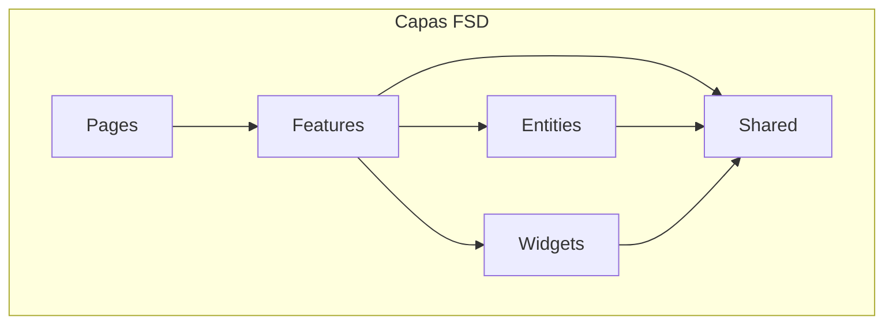
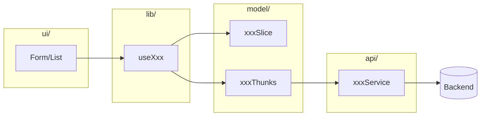
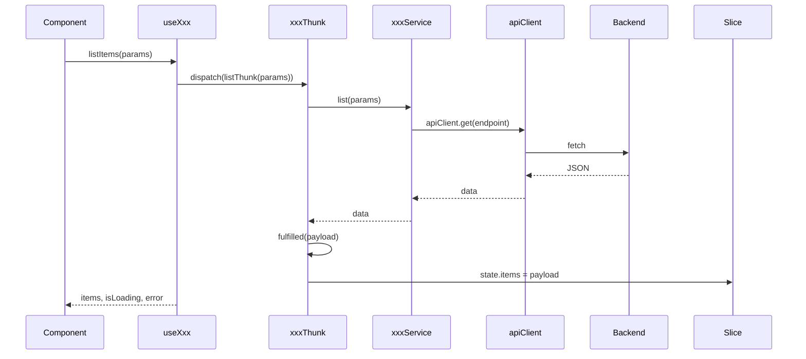
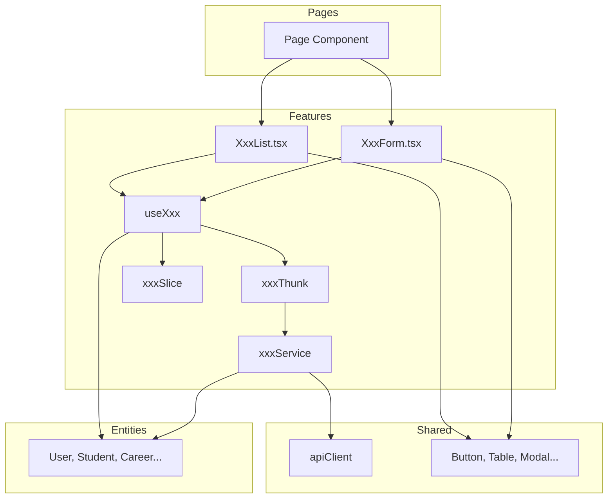

# @sistema-titulacion/features

Módulo **features** del frontend del Sistema de Titulación. Contiene la lógica de aplicación por dominio: autenticación, catálogos, estudiantes, titulaciones, reportes, respaldos, etc., siguiendo la arquitectura **Feature-Sliced Design (FSD)**.

---

## Tabla de contenidos

- [Descripción](#descripción)
- [Estructura de carpetas](#estructura-de-carpetas)
- [Diagramas](#diagramas)
- [Estructura común de un feature](#estructura-común-de-un-feature)
- [Features del módulo](#features-del-módulo)
- [Flujo de datos](#flujo-de-datos)
- [Uso e importaciones](#uso-e-importaciones)
- [Dependencias](#dependencias)

---

## Descripción

El módulo `features` encapsula la **lógica de negocio** por dominio. Cada feature proporciona:

- **api/**: Servicios que llaman al backend (apiClient, API_ENDPOINTS)
- **model/**: Estado Redux (slice + thunks), tipos
- **lib/**: Hooks que exponen selectors y acciones
- **ui/**: Componentes de presentación (listas, formularios, modales)

**Flujo típico**: UI → `useXxx()` hook → thunks → servicio API → backend.

---

## Estructura de carpetas

```
libs/frontend/features/
├── src/
│   ├── auth/                    # Autenticación
│   │   ├── api/                 # authService
│   │   ├── lib/                 # useAuth
│   │   ├── model/               # authSlice, authThunks
│   │   └── login/               # LoginForm, loginSlice
│   │
│   ├── generations/             # Generaciones (cohortes)
│   ├── graduation-options/      # Opciones de titulación
│   ├── careers/                 # Carreras
│   ├── modalities/              # Modalidades
│   ├── quotas/                  # Cupos por generación/carrera
│   ├── ingress-egress/          # Ingreso y egreso (reporte)
│   ├── students/                # Estudiantes
│   ├── captured-fields/         # Campos capturados (residencia/tesis)
│   ├── graduations/             # Titulaciones
│   ├── users/                   # Usuarios
│   ├── dashboard/               # Dashboard (resumen)
│   ├── backups/                 # Respaldos
│   ├── reports/                 # Reportes
│   │
│   └── index.ts                 # Reexporta todos los features
│
├── package.json
├── tsconfig.json
└── tsconfig.lib.json
```

---

## Diagramas

### Posición en la arquitectura FSD



### Estructura interna de un feature típico



### Flujo de datos: UI → API



---

## Estructura común de un feature

La mayoría de los features siguen este patrón:

```
feature-name/
├── api/
│   ├── index.ts
│   ├── xxxService.ts       # Llamadas a API_ENDPOINTS
│   └── *Helper.ts          # (opcional) Helpers/transformaciones
├── lib/
│   ├── index.ts
│   └── useXxx.ts           # Hook: selectors + dispatch thunks
├── model/
│   ├── index.ts
│   ├── types.ts            # Tipos e interfaces
│   ├── xxxSlice.ts         # createSlice (estado + reducers)
│   └── xxxThunks.ts        # createAsyncThunk
└── ui/
    ├── index.ts
    └── XxxList/            # Lista, formularios, modales
        ├── index.ts
        └── XxxList.tsx
```

**Excepciones**:

- **auth**: Tiene submódulo `login/` (LoginForm, loginSlice).
- **dashboard**: Sin Redux; el hook llama directamente al servicio.
- **graduations**: UI existe pero no se exporta; se usa desde estudiantes.

---

## Features del módulo

### 1. auth

**Propósito**: Autenticación (login, logout, refresh token, verificación de sesión).

| Capa  | Contenido                                                                             |
| ----- | ------------------------------------------------------------------------------------- |
| api   | `authService`: login, logout, refreshToken, getMe; manejo de tokens en localStorage   |
| model | `authSlice`, `authThunks` (login, logout, checkAuth, refresh); `loginSlice` en login/ |
| lib   | `useAuth`: user, isAuthenticated, isLoading, login, logout, checkAuth                 |
| ui    | `LoginForm`                                                                           |

---

### 2. generations

**Propósito**: CRUD de generaciones (cohortes) y activar/desactivar.

| Capa  | Contenido                                                                                |
| ----- | ---------------------------------------------------------------------------------------- |
| api   | `generationsService`: list, getById, create, update, patch, delete, activate, deactivate |
| model | `generationsSlice`, `generationsThunks`                                                  |
| lib   | `useGenerations`                                                                         |
| ui    | `GenerationForm`, `GenerationsList`                                                      |

---

### 3. graduation-options

**Propósito**: CRUD de opciones de titulación y activar/desactivar.

| Capa  | Contenido                                                                                      |
| ----- | ---------------------------------------------------------------------------------------------- |
| api   | `graduationOptionsService`: list, getById, create, update, patch, delete, activate, deactivate |
| model | `graduationOptionsSlice`, `graduationOptionsThunks`                                            |
| lib   | `useGraduationOptions`                                                                         |
| ui    | `GraduationOptionForm`, `GraduationOptionsList`                                                |

---

### 4. careers

**Propósito**: CRUD de carreras y activar/desactivar.

| Capa  | Contenido                            |
| ----- | ------------------------------------ |
| api   | `careersService`, `modalitiesHelper` |
| model | `careersSlice`, `careersThunks`      |
| lib   | `useCareers`                         |
| ui    | `CareerForm`, `CareersList`          |

---

### 5. modalities

**Propósito**: CRUD de modalidades y activar/desactivar.

| Capa  | Contenido                             |
| ----- | ------------------------------------- |
| api   | `modalitiesService`                   |
| model | `modalitiesSlice`, `modalitiesThunks` |
| lib   | `useModalities`                       |
| ui    | `ModalityForm`, `ModalitiesList`      |

---

### 6. quotas

**Propósito**: CRUD de cupos por generación y carrera; activar/desactivar.

| Capa  | Contenido                                             |
| ----- | ----------------------------------------------------- |
| api   | `quotasService`, `careersHelper`, `generationsHelper` |
| model | `quotasSlice`, `quotasThunks`                         |
| lib   | `useQuotas`                                           |
| ui    | `QuotaForm`, `QuotasList`                             |

---

### 7. ingress-egress

**Propósito**: Consultar ingreso y egreso por generación y carrera (solo lectura).

| Capa  | Contenido                                              |
| ----- | ------------------------------------------------------ |
| api   | `ingressEgressService`: list, getByGenerationAndCareer |
| model | `ingressEgressSlice`, `ingressEgressThunks`            |
| lib   | `useIngressEgress`                                     |
| ui    | `IngressEgressList`                                    |

---

### 8. students

**Propósito**: CRUD de estudiantes, cambio de estado, egreso/no egreso, listas especiales.

| Capa  | Contenido                                                                                                                                  |
| ----- | ------------------------------------------------------------------------------------------------------------------------------------------ |
| api   | `studentsService`: list, getById, create, update, patch, delete, changeStatus, inProgress, scheduled, graduated, egress, unegress; helpers |
| model | `studentsSlice`, `studentsThunks`                                                                                                          |
| lib   | `useStudents`: múltiples listas y operaciones                                                                                              |
| ui    | `StudentForm`, `StudentsList`, `StudentsInProgressList`, `StudentsScheduledList`, `StudentsGraduatedList`                                  |

---

### 9. captured-fields

**Propósito**: CRUD de campos capturados por estudiante (proyecto de titulación).

| Capa  | Contenido                                                                             |
| ----- | ------------------------------------------------------------------------------------- |
| api   | `capturedFieldsService`: getByStudent, create, update, patch, delete; `studentHelper` |
| model | `capturedFieldsSlice`, `capturedFieldsThunks`                                         |
| lib   | `useCapturedFields`                                                                   |
| ui    | `CapturedFieldsForm`                                                                  |

---

### 10. graduations

**Propósito**: CRUD de titulaciones por estudiante; graduate/ungraduate.

| Capa  | Contenido                                                                                        |
| ----- | ------------------------------------------------------------------------------------------------ |
| api   | `graduationsService`: getByStudent, create, update, patch, delete, graduate, ungraduate; helpers |
| model | `graduationsSlice`, `graduationsThunks`                                                          |
| lib   | `useGraduations`                                                                                 |
| ui    | `GraduationForm` (no exportado; usado desde estudiantes)                                         |

---

### 11. users

**Propósito**: CRUD de usuarios, activar/desactivar, cambio de contraseña, perfil.

| Capa  | Contenido                                                                                                                     |
| ----- | ----------------------------------------------------------------------------------------------------------------------------- |
| api   | `usersService`: list, getById, create, update, patch, delete, activate, deactivate, changePassword, patchMe, changePasswordMe |
| model | `usersSlice`, `usersThunks`                                                                                                   |
| lib   | `useUsers`                                                                                                                    |
| ui    | `UserForm`, `UsersList`, `ChangePasswordModal`, `ProfileModal`                                                                |

---

### 12. dashboard

**Propósito**: Datos agregados para la pantalla principal (sin Redux).

| Capa  | Contenido                                                     |
| ----- | ------------------------------------------------------------- |
| api   | `dashboardService`: get                                       |
| model | `types.ts` (DashboardResponse) — sin slice ni thunks          |
| lib   | `useDashboard`: getDashboard() llama directamente al servicio |
| ui    | `DashboardList`                                               |

---

### 13. backups

**Propósito**: Respaldos: listar, crear, eliminar, restaurar, subir.

| Capa  | Contenido                                                        |
| ----- | ---------------------------------------------------------------- |
| api   | `backupsService`: list, getById, create, delete, restore, upload |
| model | `backupsSlice`, `backupsThunks`                                  |
| lib   | `useBackups`                                                     |
| ui    | `BackupForm`, `BackupsList`                                      |

---

### 14. reports

**Propósito**: Generar reportes con filtros y exportar a Excel.

| Capa  | Contenido                                      |
| ----- | ---------------------------------------------- |
| api   | `reportsService`: generate                     |
| model | `reportsSlice`, `reportsThunks`                |
| lib   | `useReports`                                   |
| ui    | `ReportsList` (tabla agrupada, exportar Excel) |

---

## Resumen de servicios y hooks

| Feature            | Servicio                 | Hook                 | Redux             |
| ------------------ | ------------------------ | -------------------- | ----------------- |
| auth               | authService              | useAuth              | auth, login       |
| generations        | generationsService       | useGenerations       | generations       |
| graduation-options | graduationOptionsService | useGraduationOptions | graduationOptions |
| careers            | careersService           | useCareers           | careers           |
| modalities         | modalitiesService        | useModalities        | modalities        |
| quotas             | quotasService            | useQuotas            | quotas            |
| ingress-egress     | ingressEgressService     | useIngressEgress     | ingressEgress     |
| students           | studentsService          | useStudents          | students          |
| captured-fields    | capturedFieldsService    | useCapturedFields    | capturedFields    |
| graduations        | graduationsService       | useGraduations       | graduations       |
| users              | usersService             | useUsers             | users             |
| dashboard          | dashboardService         | useDashboard         | —                 |
| backups            | backupsService           | useBackups           | backups           |
| reports            | reportsService           | useReports           | reports           |

---

## Flujo de datos



---

## Uso e importaciones

### Alias de rutas

El proyecto usa el alias `@features` → `libs/frontend/features/src`:

```typescript
// Hooks y acciones
import { useAuth } from '@features/auth';
import { useStudents } from '@features/students';
import { useCareers } from '@features/careers';

// UI
import { LoginForm } from '@features/auth/login';
import { GenerationsList, GenerationForm } from '@features/generations';
import { StudentsList } from '@features/students';

// Servicios (menos común, normalmente se usa el hook)
import { authService } from '@features/auth';
import { studentsService } from '@features/students';
```

### Uso típico en una página

```tsx
import { GenerationsList } from '@features/generations';
import { useGenerations } from '@features/generations';

function GenerationsPage() {
  const { generations, pagination, isLoadingList, listStudents, listError } = useGenerations();

  useEffect(() => {
    listStudents({ page: 1, limit: 10 });
  }, []);

  return <GenerationsList data={generations} pagination={pagination} isLoading={isLoadingList} onList={listStudents} error={listError} />;
}
```

---

## Dependencias

- **@entities** – Tipos (User, Student, Career, etc.)
- **@shared** – apiClient, API_ENDPOINTS, logger, Result, tipos Redux, componentes UI
- **react**, **react-redux**, **@reduxjs/toolkit**
- **react-router-dom** – para navegación en algunas UI
- **recharts** – gráficos (dashboard, reportes)

---

## Tags Nx

- `scope:features`
- `type:fsd`

---

## Consumidores principales

El módulo features es utilizado por:

- **pages** – Páginas que importan listas, formularios y hooks
- **apps** – El store Redux registra los reducers de cada feature; el router enlaza rutas con páginas que usan features

---

## Documentación adicional

Para descripción más detallada de cada feature (operaciones, tipos, thunks específicos), ver `docs/MODULO_FEATURES.md`.
