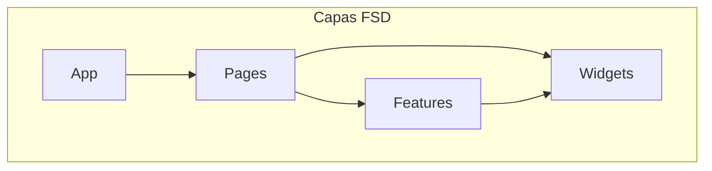
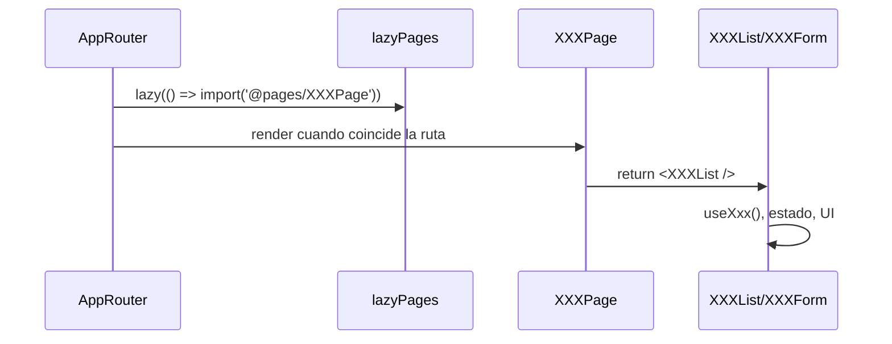
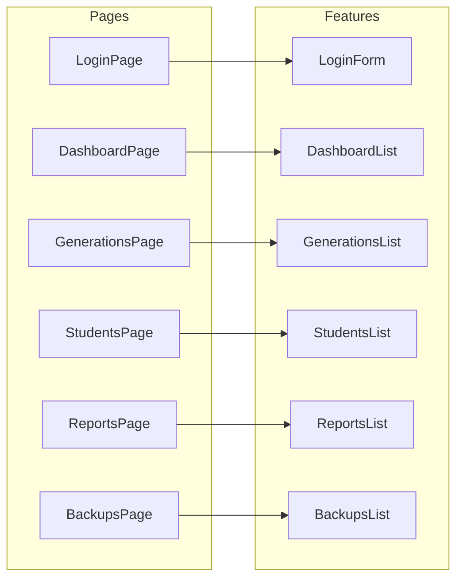

# @sistema-titulacion/pages

Módulo **pages** del frontend del Sistema de Titulación. Contiene los componentes de página que orquestan la composición de features y widgets para cada ruta de la aplicación, siguiendo la arquitectura **Feature-Sliced Design (FSD)**.

---

## Tabla de contenidos

- [Descripción](#descripción)
- [Estructura de carpetas](#estructura-de-carpetas)
- [Diagramas](#diagramas)
- [Páginas del módulo](#páginas-del-módulo)
- [Uso e importaciones](#uso-e-importaciones)
- [Dependencias](#dependencias)

---

## Descripción

El módulo `pages` define las **páginas** de la aplicación. En su mayoría son componentes de **orquestación** que:

- Importan el componente de la feature correspondiente (lista, formulario, dashboard)
- Lo renderizan sin añadir lógica de negocio
- Sirven como punto de entrada por ruta

**Excepción**: `ComingSoonPage` tiene su propia UI (no delega en una feature).

Las páginas se cargan con **lazy loading** en el router de la app.

---

## Estructura de carpetas

```
libs/frontend/pages/
├── src/
│   ├── LoginPage/              # Página de login (pública)
│   │   ├── LoginPage.tsx
│   │   └── index.ts
│   │
│   ├── ComingSoonPage/         # Página "próximamente"
│   │   ├── ComingSoonPage.tsx
│   │   └── index.ts
│   │
│   ├── DashboardPage/          # Panel principal
│   ├── GenerationsPage/        # Generaciones
│   ├── GraduationOptionsPage/  # Opciones de titulación
│   ├── CareersPage/            # Carreras
│   ├── ModalitiesPage/         # Modalidades
│   ├── NewAdmissionsPage/      # Nuevo ingreso
│   ├── IngressEgressPage/      # Ingreso y egreso
│   ├── StudentsPage/           # Estudiantes (vista general)
│   ├── StudentsInProgressPage/ # Estudiantes en proceso
│   ├── StudentsScheduledPage/  # Estudiantes programados
│   ├── StudentsGraduatedPage/  # Estudiantes titulados
│   ├── AccessesPage/           # Accesos (usuarios)
│   ├── BackupsPage/            # Respaldos
│   ├── ReportsPage/            # Reportes
│   │
│   └── index.ts                # Reexporta todas las páginas
│
├── package.json
├── tsconfig.json
└── tsconfig.lib.json
```

### Patrón de una página típica

Cada página sigue la misma estructura:

```
NombrePage/
├── NombrePage.tsx    # Componente que renderiza la feature
└── index.ts          # export * from './NombrePage'
```

---

## Diagramas

### Posición en la arquitectura FSD



### Flujo: Router → Page → Feature



### Mapa de páginas y features



---

## Páginas del módulo

| Página                     | Feature que renderiza  | Ruta típica                        |
| -------------------------- | ---------------------- | ---------------------------------- |
| **LoginPage**              | LoginForm              | `/login`                           |
| **ComingSoonPage**         | — (UI propia)          | rutas en desarrollo                |
| **DashboardPage**          | DashboardList          | `/dashboard`                       |
| **GenerationsPage**        | GenerationsList        | `/generation`                      |
| **GraduationOptionsPage**  | GraduationOptionsList  | `/graduation-options`              |
| **CareersPage**            | CareersList            | `/careers`                         |
| **ModalitiesPage**         | ModalitiesList         | `/modalities`                      |
| **NewAdmissionsPage**      | NewAdmissionsList      | `/ingress-egresses/new-admissions` |
| **IngressEgressPage**      | IngressEgressList      | `/ingress-egresses`                |
| **StudentsPage**           | StudentsList           | `/students`                        |
| **StudentsInProgressPage** | StudentsInProgressList | `/students/in-progress`            |
| **StudentsScheduledPage**  | StudentsScheduledList  | `/students/scheduled`              |
| **StudentsGraduatedPage**  | StudentsGraduatedList  | `/students/graduated`              |
| **AccessesPage**           | UsersList              | `/accesses`                        |
| **BackupsPage**            | BackupsList            | `/backups`                         |
| **ReportsPage**            | ReportsList            | `/reports`                         |

---

### Páginas especiales

#### LoginPage

Página pública que renderiza el formulario de login.

```tsx
export function LoginPage() {
  return <LoginForm />;
}
```

#### ComingSoonPage

Página con UI propia para funcionalidades en desarrollo. Acepta props opcionales:

```tsx
interface ComingSoonPageProps {
  title?: string;
  description?: string;
}

<ComingSoonPage title="Próximamente" description="Esta funcionalidad está en desarrollo..." />;
```

---

## Uso e importaciones

### Alias de rutas

El proyecto usa el alias `@pages` → `libs/frontend/pages/src`:

```typescript
// Importación directa
import { LoginPage } from '@pages/LoginPage';
import { DashboardPage } from '@pages/DashboardPage';

// Lazy loading (recomendado para el router)
const LoginPage = lazy(() => import('@pages/LoginPage').then((m) => ({ default: m.LoginPage })));
```

### Uso en el router

Las páginas se cargan de forma lazy en `lazyPages.ts`:

```typescript
// apps/sistema-titulacion-cliente/src/app/providers/router/lazyPages.ts
export const LoginPage = lazy(() =>
  import('@pages/LoginPage').then((module) => ({
    default: module.LoginPage,
  }))
);

export const DashboardPage = lazy(() =>
  import('@pages/DashboardPage').then((module) => ({
    default: module.DashboardPage,
  }))
);

// ... resto de páginas
```

### Agregar una nueva página

1. Crear la carpeta en `libs/frontend/pages/src/`:

   ```
   NuevaPage/
   ├── NuevaPage.tsx
   └── index.ts
   ```

2. Implementar la página (orquestación):

   ```tsx
   import { NuevaList } from '@features/nueva/ui';

   export function NuevaPage() {
     return <NuevaList />;
   }
   ```

3. Exportar en `src/index.ts`:

   ```ts
   export * from './NuevaPage';
   ```

4. Añadir lazy loading en `lazyPages.ts` y la ruta en `AppRouter`.

---

## Dependencias

- **@features** – Componentes de lista/formulario que orquestan las páginas
- **react**

Las páginas no usan `@shared` ni `@entities` directamente; la lógica y los componentes vienen de las features.

---

## Tags Nx

- `scope:pages`
- `type:fsd`

---

## Consumidores principales

El módulo pages es utilizado por:

- **apps/sistema-titulacion-cliente** – `AppRouter` y `lazyPages.ts` para las rutas de la aplicación
