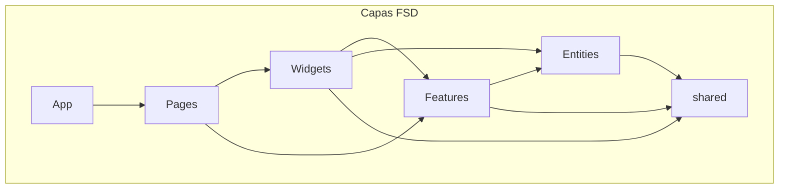
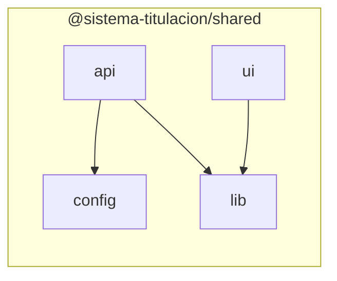
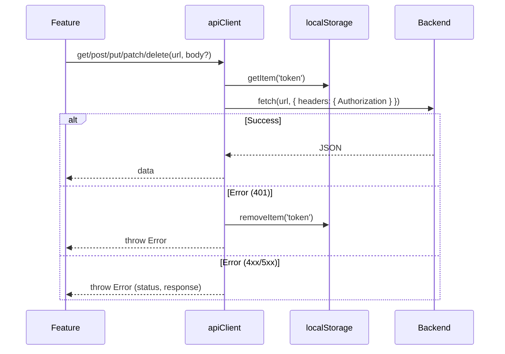
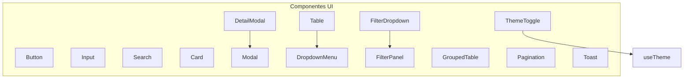

# @sistema-titulacion/shared

Módulo **shared** del frontend del Sistema de Titulación. Contiene código reutilizable consumido por las capas superiores (features, widgets, pages, entities) siguiendo la arquitectura **Feature-Sliced Design (FSD)**.

---

## Tabla de contenidos

- [Descripción](#descripción)
- [Estructura de carpetas](#estructura-de-carpetas)
- [Diagramas](#diagramas)
- [API](#api)
- [Configuración](#configuración)
- [Lib (utilidades)](#lib-utilidades)
- [UI (componentes)](#ui-componentes)
- [Uso e importaciones](#uso-e-importaciones)
- [Dependencias](#dependencias)

---

## Descripción

El módulo `shared` es la capa base del frontend. Proporciona:

- **API**: Cliente HTTP y definición de endpoints
- **Config**: Variables de entorno y validación
- **Lib**: Utilidades (logger, excel, validación, tipos, tema, redux)
- **UI**: Componentes React reutilizables (Button, Table, Modal, etc.)

Todos los componentes UI soportan **modo claro y oscuro** mediante variables CSS (`--color-*`).

---

## Estructura de carpetas

```
libs/frontend/shared/
├── src/
│   ├── api/                 # Capa de comunicación HTTP
│   │   ├── apiClient.ts     # Cliente fetch con auth y manejo de errores
│   │   ├── endpoints.ts     # Constantes de endpoints del backend
│   │   └── index.ts
│   │
│   ├── config/              # Configuración de la aplicación
│   │   ├── env.ts           # Variables de entorno (Vite)
│   │   └── index.ts
│   │
│   ├── lib/                 # Utilidades y helpers
│   │   ├── excel/           # Exportación a Excel (SheetJS)
│   │   │   ├── exportTable.ts
│   │   │   ├── exportGroupedTable.ts
│   │   │   └── index.ts
│   │   ├── logger/          # Logger configurable
│   │   │   ├── logger.ts
│   │   │   └── index.ts
│   │   ├── model/           # Tipos genéricos (paginación, Result, etc.)
│   │   │   ├── types.ts
│   │   │   └── index.ts
│   │   ├── redux/           # Tipos para Redux (AppDispatch, BaseAppState)
│   │   │   ├── types.ts
│   │   │   └── index.ts
│   │   ├── theme/           # Hook useTheme (light/dark)
│   │   │   ├── useTheme.ts
│   │   │   └── index.ts
│   │   ├── validation/      # Validadores (password)
│   │   │   ├── password.ts
│   │   │   └── index.ts
│   │   └── index.ts
│   │
│   ├── ui/                  # Componentes React reutilizables
│   │   ├── Button/          # Botón con variantes
│   │   ├── Card/            # Tarjeta contenedor
│   │   ├── DetailModal/     # Modal de detalle de fila
│   │   ├── DropdownMenu/    # Menú contextual
│   │   ├── FilterDropdown/  # Dropdown con FilterPanel
│   │   ├── FilterPanel/     # Panel de filtros (checkbox, toggle, select)
│   │   ├── Input/           # Campo de entrada
│   │   ├── Modal/           # Modal genérico
│   │   ├── Pagination/      # Paginación
│   │   ├── Search/          # Campo de búsqueda
│   │   ├── Table/           # Tabla, GroupedTable, hooks
│   │   ├── ThemeToggle/     # Switch tema claro/oscuro
│   │   ├── Toast/           # Notificaciones toast
│   │   └── index.ts
│   │
│   └── index.ts             # Punto de entrada (exporta api, config, lib)
│
├── package.json
├── tsconfig.json
├── tsconfig.lib.json
└── README.md
```

### Roles de cada carpeta

| Carpeta   | Rol                                                                                                    |
| --------- | ------------------------------------------------------------------------------------------------------ |
| `api/`    | Cliente HTTP centralizado, endpoints tipados, manejo de errores y autenticación (Bearer token).        |
| `config/` | Variables de entorno (Vite), validación en desarrollo.                                                 |
| `lib/`    | Utilidades sin dependencias de negocio: logger, excel, tipos genéricos, tema, validación, tipos Redux. |
| `ui/`     | Componentes React de presentación sin lógica de negocio. Todos soportan modo claro/oscuro.             |

---

## Diagramas

### Posición en la arquitectura FSD



### Dependencias internas del módulo shared



### Flujo del API Client



### Componentes UI y sus relaciones



---

## API

### apiClient

Cliente HTTP con soporte para:

- Métodos: `get`, `post`, `put`, `patch`, `delete`
- Autenticación Bearer (token desde `localStorage`)
- Base URL desde `env.apiBaseUrl`
- Manejo de errores (401 → remove token)
- Parseo automático de JSON

```typescript
import { apiClient } from '@shared/api';

const data = await apiClient.get<User[]>('/users');
await apiClient.post('/users', { name: 'Juan' });
```

### API_ENDPOINTS

Constantes de rutas del backend:

- `AUTH` (login, logout, me, refresh)
- `USERS`, `DASHBOARD`
- `GRADUATION_OPTIONS`, `GENERATIONS`, `MODALITIES`, `CAREERS`, `QUOTAS`
- `STUDENTS`, `CAPTURED_FIELDS`, `GRADUATIONS`
- `INGRESS_EGRESS`, `BACKUPS`, `REPORTS`

```typescript
import { API_ENDPOINTS } from '@shared/api';

const url = API_ENDPOINTS.STUDENTS.DETAIL('123');
const listUrl = API_ENDPOINTS.CAREERS.LIST;
```

---

## Configuración

### env

Variables de entorno (Vite):

- `VITE_APP_ENV` – development, production
- `VITE_API_BASE_URL` – URL base del API
- `VITE_API_TIMEOUT`
- `VITE_APP_NAME`, `VITE_APP_VERSION`
- `VITE_ENABLE_LOGGER`, `VITE_MIN_LOG_LEVEL`
- `VITE_ENABLE_MOCK_API`

```typescript
import { env, validateEnv } from '@shared/config';

console.log(env.apiBaseUrl);
validateEnv(); // En desarrollo, valida variables
```

---

## Lib (utilidades)

### logger

Logger condicional según `VITE_ENABLE_LOGGER` y `VITE_MIN_LOG_LEVEL`:

```typescript
import { logger } from '@shared/lib';

logger.log('debug');
logger.info('info');
logger.warn('warn');
logger.error('error');
```

### excel

Exportar tablas a Excel (.xlsx):

- `exportTable` – tabla plana con columnas
- `exportGroupedTable` – tabla agrupada (dos niveles de encabezados)

```typescript
import { exportTable, exportGroupedTable } from '@shared/lib/excel';
```

### model (tipos)

- `PaginationParams` – page, limit, sortBy, sortOrder
- `PaginationData` – respuesta paginada
- `ListResponse<T>` – data + pagination
- `SearchParams` – extiende PaginationParams con search, activeOnly
- `Result<T>` – { success: true, data } | { success: false, error, code? }
- `extractErrorCode(payload)` – extrae código de error de thunks

```typescript
import type { PaginationParams, ListResponse, Result, SearchParams } from '@shared/lib/model';
import { extractErrorCode } from '@shared/lib/model';
```

### redux

- `AppDispatch` – ThunkDispatch tipado
- `BaseAppState` – estado base de la app

```typescript
import type { AppDispatch, BaseAppState } from '@shared/lib/redux';
```

### theme

Hook para tema claro/oscuro:

```typescript
import { useTheme } from '@shared/lib/theme';

const { theme, toggleTheme, setTheme, isSystemDark } = useTheme();
```

### validation

Validación de contraseña:

```typescript
import { isValidPasswordFormat, getPasswordValidationError } from '@shared/lib/validation';

const error = getPasswordValidationError(password);
if (error) {
  // Mostrar error al usuario
}
```

---

## UI (componentes)

Los componentes se importan desde `@shared/ui`:

```typescript
import { Button, Input, Search, Card, Modal, DetailModal, DropdownMenu, FilterPanel, FilterDropdown, Table, GroupedTable, Pagination, Toast, ToastProvider, useToast, ThemeToggle, useTableSort, useTableFilters, createStatusActions, sortTableData, getNestedValue } from '@shared/ui';
```

### Componentes básicos

| Componente | Descripción                                                                                                  |
| ---------- | ------------------------------------------------------------------------------------------------------------ |
| `Button`   | Botón con variantes: primary, secondary, ghost, outline. Tamaños: small, medium, large. Soporta `isLoading`. |
| `Input`    | Campo de texto con label, error, fullWidth. Variantes: default, calendar, year.                              |
| `Search`   | Búsqueda con icono, botón limpiar. `onSearch` al presionar Enter.                                            |
| `Card`     | Contenedor con variantes: elevated, outlined, flat. Padding: none, small, medium, large.                     |

### Modales y overlays

| Componente     | Descripción                                                                                 |
| -------------- | ------------------------------------------------------------------------------------------- |
| `Modal`        | Modal genérico con título, onClose, maxWidth (sm, md, lg, xl, 2xl). Cierra con ESC.         |
| `DetailModal`  | Modal para mostrar detalles de una fila. Campos con `key`, `label`, `render`, `fullWidth`.  |
| `DropdownMenu` | Menú contextual con posición (x, y). Items con label, onClick, variant (danger), separator. |

### Tablas

| Componente     | Descripción                                                                                                      |
| -------------- | ---------------------------------------------------------------------------------------------------------------- |
| `Table`        | Tabla con columnas configurables, ordenamiento, columna de estado, `rowActions` (menú contextual), `onRowClick`. |
| `GroupedTable` | Tabla con encabezados de dos niveles (grupos + subcolumnas), colores por tema.                                   |
| `Pagination`   | Paginación compatible con respuesta del backend (page, totalPages, hasPrevPage, etc.).                           |

### Filtros

| Componente       | Descripción                                                                                           |
| ---------------- | ----------------------------------------------------------------------------------------------------- |
| `FilterPanel`    | Panel de filtros: checkbox, toggle, select. Opciones locales o predefinidas. Botones Aplicar/Limpiar. |
| `FilterDropdown` | FilterPanel dentro de un dropdown, posicionado por `triggerRef`.                                      |

### Feedback y tema

| Componente      | Descripción                                               |
| --------------- | --------------------------------------------------------- |
| `Toast`         | Notificación toast. Tipos: success, error, warning, info. |
| `ToastProvider` | Proveedor de contexto para toasts.                        |
| `useToast`      | `showToast({ type, message, title?, duration? })`.        |
| `ThemeToggle`   | Switch para alternar tema claro/oscuro.                   |

### Hooks y utilidades de tabla

- `useTableSort(data, initialSortColumn?, initialSortDirection?)` – ordenamiento local
- `useTableFilters(data, filters)` – filtrado local
- `createStatusActions(row, config)` – genera items para `rowActions` según transiciones de estado
- `sortTableData`, `getNestedValue` – helpers para tablas

---

## Uso e importaciones

### Alias de rutas

El proyecto usa el alias `@shared` → `libs/frontend/shared/src`:

```typescript
// API y config
import { apiClient, API_ENDPOINTS } from '@shared/api';
import { env } from '@shared/config';

// Lib
import { logger } from '@shared/lib';
import { exportTable } from '@shared/lib/excel';
import type { ListResponse, Result, SearchParams } from '@shared/lib/model';
import type { AppDispatch } from '@shared/lib/redux';
import { useTheme } from '@shared/lib/theme';
import { getPasswordValidationError } from '@shared/lib/validation';

// UI
import { Button, Input, Table, Modal, useToast } from '@shared/ui';
```

### Ejemplo de lista con tabla

```tsx
import { Table, Search, FilterDropdown, Pagination, DetailModal, Button, useToast } from '@shared/ui';
import { exportTable } from '@shared/lib/excel';
import { apiClient, API_ENDPOINTS } from '@shared/api';
import type { TableColumn, DetailField } from '@shared/ui';

// Configurar columnas, filtros, paginación, exportar a Excel, etc.
```

---

## Dependencias

- **React** – componentes UI
- **react-dom** – `createPortal` para modales y dropdowns
- **xlsx** (SheetJS) – exportación a Excel
- **@reduxjs/toolkit** – tipos para `AppDispatch`

---

## Tags Nx

- `scope:shared`
- `type:fsd`

---

## Consumidores principales

El módulo shared es utilizado por:

- **features**: students, users, careers, generations, modalities, quotas, backups, reports, dashboard, auth, etc.
- **widgets**: Header, PageHeader
- **apps**: sistema-titulacion-cliente (mocks, providers)
