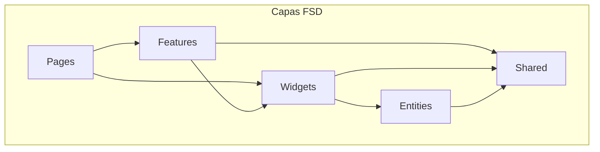
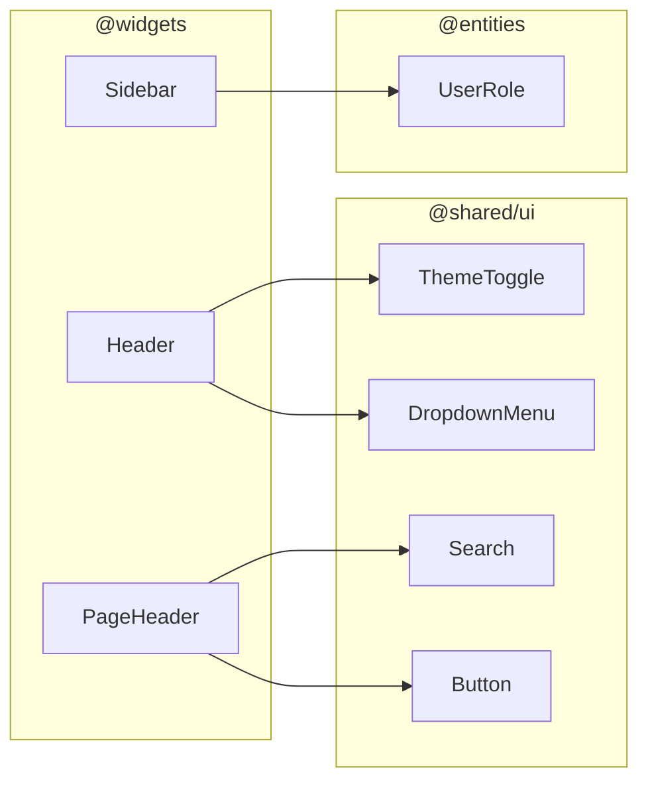
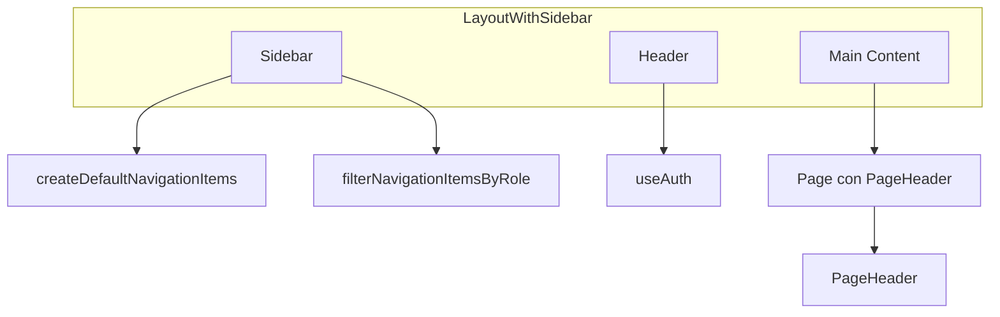

# @sistema-titulacion/widgets

Módulo **widgets** del frontend del Sistema de Titulación. Contiene componentes compuestos que combinan entidades, shared y lógica de presentación para secciones de la aplicación (layout, navegación, headers), siguiendo la arquitectura **Feature-Sliced Design (FSD)**.

---

## Tabla de contenidos

- [Descripción](#descripción)
- [Estructura de carpetas](#estructura-de-carpetas)
- [Diagramas](#diagramas)
- [Widgets del módulo](#widgets-del-módulo)
- [Uso e importaciones](#uso-e-importaciones)
- [Dependencias](#dependencias)

---

## Descripción

El módulo `widgets` agrupa **componentes de composición** usados en el layout y en las páginas:

- **Sidebar** – Navegación lateral con items, subitems y filtrado por rol
- **Header** – Barra superior con título, usuario, menú dropdown y tema
- **PageHeader** – Cabecera de página con título, búsqueda, acciones y filtros

Los widgets usan componentes de `@shared/ui` y tipos de `@entities`; no contienen lógica de negocio ni llamadas a API directas.

---

## Estructura de carpetas

```
libs/frontend/widgets/
├── src/
│   ├── Header/                   # Barra superior de la app
│   │   ├── model/
│   │   │   ├── types.ts          # HeaderProps, UserInfo
│   │   │   └── index.ts
│   │   ├── ui/
│   │   │   ├── Header.tsx
│   │   │   ├── icons.tsx
│   │   │   └── index.ts
│   │   └── index.ts
│   │
│   ├── PageHeader/               # Cabecera de páginas de lista
│   │   ├── model/
│   │   │   └── types.ts          # PageHeaderProps
│   │   ├── ui/
│   │   │   ├── PageHeader.tsx
│   │   │   ├── icons.tsx
│   │   │   └── index.ts
│   │   └── index.ts
│   │
│   ├── Sidebar/                  # Navegación lateral
│   │   ├── lib/
│   │   │   ├── navigationItems.tsx  # createDefaultNavigationItems, filterNavigationItemsByRole
│   │   │   └── index.ts
│   │   ├── model/
│   │   │   ├── types.ts          # SidebarItem, SidebarSubItem, SidebarProps
│   │   │   └── index.ts
│   │   ├── ui/
│   │   │   ├── Sidebar.tsx
│   │   │   ├── icons.tsx
│   │   │   └── index.ts
│   │   └── index.ts
│   │
│   └── index.ts                 # Reexporta todos los widgets
│
├── package.json
├── tsconfig.json
└── tsconfig.lib.json
```

### Rol de cada carpeta

| Carpeta       | Rol                                                                                                                                                  |
| ------------- | ---------------------------------------------------------------------------------------------------------------------------------------------------- |
| `Header/`     | Barra superior con título, botón atrás, ThemeToggle, menú de usuario (Perfil, Cambiar contraseña, Salir). Soporta móvil con botón hamburguesa.       |
| `PageHeader/` | Cabecera reutilizable para páginas de listado: título, Search, botón Añadir, Filtros, Exportar a Excel.                                              |
| `Sidebar/`    | Navegación lateral con items/subitems, colapsable, drawer móvil, menú Salir. Incluye `createDefaultNavigationItems` y `filterNavigationItemsByRole`. |

---

## Diagramas

### Posición en la arquitectura FSD



### Dependencias internas de widgets



### Uso en el layout



---

## Widgets del módulo

### 1. Sidebar

**Propósito**: Navegación lateral con items, subitems, colapso y soporte móvil.

| Capa  | Contenido                                                                        |
| ----- | -------------------------------------------------------------------------------- |
| model | `SidebarItem`, `SidebarSubItem`, `SidebarProps`                                  |
| lib   | `createDefaultNavigationItems()`, `filterNavigationItemsByRole(items, userRole)` |
| ui    | `Sidebar`, iconos (PanelIcon, OptionsIcon, StudentsIcon, etc.)                   |

**Props principales**:

- `items`: array de `SidebarItem` (id, label, icon, path, subItems, requiredRole)
- `activeItemId`: id del item activo
- `onItemClick`: callback al hacer clic en un item
- `onLogout`: callback al hacer clic en Salir
- `logo`: nodo opcional para el logo
- `isMobileOpen`, `onMobileClose`: control del drawer móvil

**Subitems**: Cada item puede tener `subItems` con id, label, path y `requiredRole`.

---

### 2. Header

**Propósito**: Barra superior con título, botón atrás, toggle de tema y menú de usuario.

| Capa  | Contenido                 |
| ----- | ------------------------- |
| model | `HeaderProps`, `UserInfo` |
| ui    | `Header`                  |

**Props principales**:

- `title`: título opcional
- `showBackButton`, `onBack`: botón de volver
- `user`: `{ name, role, avatar?, email? }` para el menú de usuario
- `onProfileClick`, `onChangePasswordClick`, `onLogoutClick`: callbacks del menú
- `onMenuClick`: callback para el botón hamburguesa (móvil)

**Componentes usados**: ThemeToggle, DropdownMenu de `@shared/ui`.

---

### 3. PageHeader

**Propósito**: Cabecera estándar para páginas de listado (título, búsqueda, acciones, filtros).

| Capa  | Contenido         |
| ----- | ----------------- |
| model | `PageHeaderProps` |
| ui    | `PageHeader`      |

**Props principales**:

- `title`: título de la página
- `searchPlaceholder`, `searchValue`, `onSearchChange`, `onSearch`, `onSearchClear`: búsqueda
- `primaryAction`: `{ label, onClick, icon?, isLoading? }` (ej. Añadir)
- `filters`: `{ label?, onClick, isActive?, buttonRef? }` para el botón de filtros
- `exportAction`: `{ label?, onClick, isLoading?, disabled? }` para exportar a Excel

**Componentes usados**: Search, Button de `@shared/ui`.

---

## Resumen de exportaciones

| Widget         | Exportaciones                                                                                                                                  |
| -------------- | ---------------------------------------------------------------------------------------------------------------------------------------------- |
| **Sidebar**    | `Sidebar`, `SidebarProps`, `SidebarItem`, `createDefaultNavigationItems`, `filterNavigationItemsByRole`, iconos (PanelIcon, OptionsIcon, etc.) |
| **Header**     | `Header`, `HeaderProps`, `UserInfo`                                                                                                            |
| **PageHeader** | `PageHeader`, `PageHeaderProps`                                                                                                                |

---

## Uso e importaciones

### Alias de rutas

El proyecto usa el alias `@widgets` → `libs/frontend/widgets/src`:

```typescript
// Sidebar (layout)
import { Sidebar, createDefaultNavigationItems, filterNavigationItemsByRole } from '@widgets/Sidebar';
import type { SidebarItem } from '@widgets/Sidebar';

// Header (layout)
import { Header } from '@widgets/Header';

// PageHeader (páginas de lista)
import { PageHeader } from '@widgets/PageHeader';

// O desde el index principal
import { Sidebar, Header, PageHeader } from '@widgets';
```

### Uso en LayoutWithSidebar

```tsx
import { Sidebar, Header } from '@widgets';
import {
  createDefaultNavigationItems,
  filterNavigationItemsByRole,
} from '@widgets/Sidebar';
import type { SidebarItem } from '@widgets/Sidebar';
import { useAuth } from '@features/auth';

function LayoutWithSidebar() {
  const { user } = useAuth();
  const navItems = useMemo(() => {
    const items = createDefaultNavigationItems();
    return filterNavigationItemsByRole(items, user?.role);
  }, [user?.role]);

  return (
    <div className="flex">
      <Sidebar
        items={navItems}
        activeItemId={currentRouteId}
        onItemClick={(item) => navigate(item.path)}
        onLogout={handleLogout}
        isMobileOpen={isMobileOpen}
        onMobileClose={() => setIsMobileOpen(false)}
      />
      <div>
        <Header
          title="..."
          user={{ name: user?.username, role: user?.role }}
          onProfileClick={...}
          onChangePasswordClick={...}
          onLogoutClick={...}
          onMenuClick={() => setIsMobileOpen(true)}
        />
        <main>{children}</main>
      </div>
    </div>
  );
}
```

### Uso de PageHeader en listas

```tsx
import { PageHeader } from '@widgets/PageHeader';

<PageHeader
  title="Estudiantes"
  searchPlaceholder="Buscar estudiante"
  searchValue={searchTerm}
  onSearchChange={setSearchTerm}
  onSearch={(value) => listStudents({ search: value })}
  primaryAction={{
    label: 'Añadir',
    onClick: () => handleAdd(),
  }}
  filters={{
    label: 'Filtros',
    onClick: () => setIsFiltersOpen(true),
    buttonRef: filterButtonRef,
  }}
  exportAction={{
    label: 'Exportar a Excel',
    onClick: handleExport,
    isLoading: isExporting,
  }}
/>;
```

---

## Dependencias

- **@shared/ui** – ThemeToggle, DropdownMenu, Search, Button
- **@entities/user** – UserRole (filtrado de navegación)
- **react**, **react-dom**

---

## Tags Nx

- `scope:widgets`
- `type:fsd`

---

## Consumidores principales

El módulo widgets es utilizado por:

- **apps/sistema-titulacion-cliente** – LayoutWithSidebar (Sidebar, Header)
- **libs/frontend/features** – PageHeader en listas (StudentsList, CareersList, GenerationsList, etc.)
